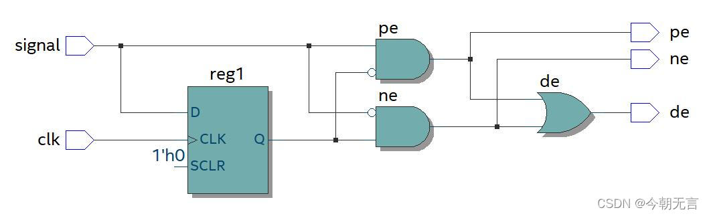
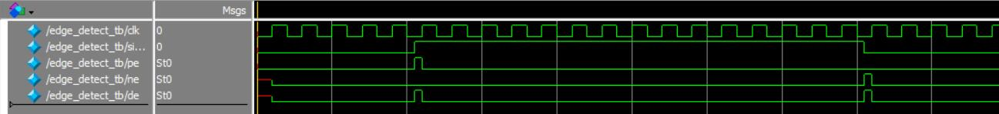
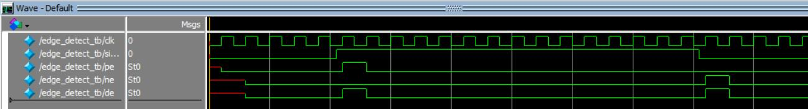
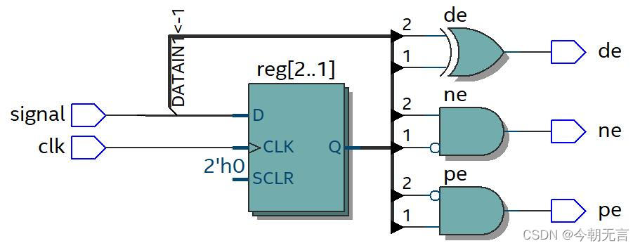

# FPGA边缘检测（上升沿、下降沿、双边沿）的三种实现方案

Created: March 10, 2024 10:02 AM
Tags: CPLD, FPGA
Property: Jason Wang

边缘检测在数字电路设计中非常常见，通常包含上升沿检测（posedge）、下降沿检测(negedge)、以及双边沿检测(double edge)。

边缘检测虽然实现非常简单，但有一些值得注意的地方，在设计中一不留神可能就会出现边沿漏检的情况。下面结合代码、电路图以及仿真时序，来扒一扒里面的坑。

## 第一种

先来看一种，这是最常见的一种边沿检测设计方案，但其中存在很大的隐患，非常容易漏检：

```verilog
module edge_detect1(
input	clk,
input	signal,
output	pe,		//上升沿
output	ne,		//下降沿
output	de		//双边沿
);

reg reg1;

always@(posedge clk) begin
	reg1	<= signal;
end

assign pe	= (~reg1) & signal;
assign ne	= reg1 & (~signal);
assign de	= pe | ne; // 或 reg1 ^ signal

endmodule

```

对应的电路结构如下



该结构的边沿检测模块，仅使用到1个寄存器，其边沿输出通过信号 signal 与前一时刻的 signal 做逻辑运算得到，正因此，其一旦signal信号发生变动，其边沿信号也会随之改变，其优点是边沿信号**响应迅速**，而缺点是边沿信号**高电平时间小于一个 clk 周期**，因此容易出现漏检。其时序仿真如下



## 第二种

既然第一种边沿检测模块的问题出在边沿信号随 signal 信号实时改变，因此我们很容易想到解决的方法：在信号输出端口添加寄存器，从而使边沿信号高电平维持一个时钟周期。

```verilog
module edge_detect2(
input		clk,
input		signal,
output	reg	pe,		//上升沿
output	reg	ne,		//下降沿
output	reg	de		//双边沿
);

reg reg1;

always@(posedge clk) begin
	reg1	<= signal;
	
	pe		<= (~reg1) & signal;
	ne		<= reg1 & (~signal);
	de		<= reg1 ^ signal;
end

endmodule

```


通过在输出端口添加寄存器，可以有效削弱输出信号对输入信号的依赖，从而提高系统的稳定性，时序仿真如下



可以看到，其边沿信号响应会略有迟滞，迟滞时间小于一个时钟周期，而边沿信号高电平时间将维持一个时钟周期。

## 第三种

第二种边沿检测方案尽管解决了边沿信号高电平时间过短的问题，但需要消耗4个寄存器，我们能不能减少寄存器，而达到同样的效果呢？我们第二种方案维持信号的方式是直接寄存输出信号的值，但实际上我们也可以通过寄存 signal 信号达到信号保持的目的。

```verilog
module edge_detect3(
input	clk,
input	signal,
output	pe,		//上升沿
output	ne,		//下降沿
output	de		//双边沿
);

reg reg1,reg_2;

always@(posedge clk) begin
	reg1	<= signal;
	reg2	<= reg1;
end

assign pe	= reg1 & (~reg2);
assign ne	= (~reg1) & reg2;
assign de	= reg1 ^ reg2;

endmodule

```


[https://www.notion.so](https://www.notion.so)

该方案中，对 signal 进行连续两次寄存，两寄存器 reg1、reg2 相串联，而边沿信号通过 reg1 和 reg2 逻辑运算得到。

此种方案下，其逻辑功能与第二种方案完全一致，但只需要两个寄存器，在资源受限的情况下可以采用该方案，从而达到节省逻辑资源的目的。
————————————————

原文链接：[https://blog.csdn.net/qq_43557686/article/details/123763384](https://blog.csdn.net/qq_43557686/article/details/123763384)