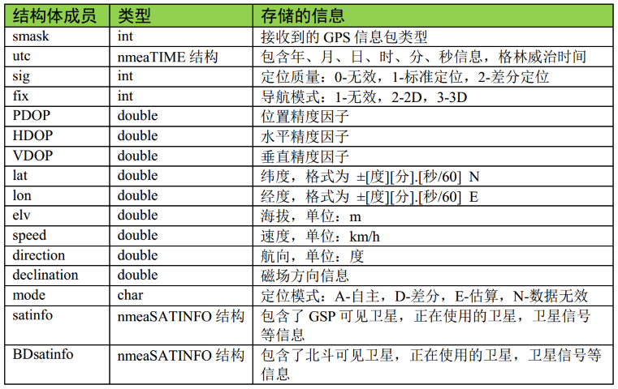

# NEMA库和相关资料

Created: March 15, 2024 1:15 PM
Tags: C语言学习相关
Property: Jason Wang

原文链接：

[1. GPS — 快速使用手册—基于LubanCat-RK356x系列板卡  文档](https://doc.embedfire.com/linux/rk356x/quick_start/zh/latest/lubancat_rk_software_hardware/hardware/gps/gps.html)

已经交叉编译好的压缩包（armhf格式）：
[NMEA_GPS解码库.tar.gz](file:///media/sf_D_DRIVE/BaiduNetdiskWorkspace/Linux_work/NMEA_GPS解码库.tar.gz)

### 1.2.3. 验证模块是否正常工作

1、要验证模块是否工作，首先要检查供电是否正常，按照上述硬件接线进行连接，BH-ATGM332D模块的LED灯会亮起。

2、确保模块供电正常后，在终端输入以下命令，监听模块发来的信息。

```bash
cat /dev/ttyS3
```

输出了以下内容，则表示模块正常工作：


注意看输入的内容 `$GPTXT,01,01,01,ANTENNA OK*35` ，它表示模块正常运行，当然也可能是其他情况，比如：


图中的三种状态分别为开路（OPEN） 、 SHORT（短路） 及 OK（正常） ， 测试时请确保天线处于 OK 状态。

如果输出的数据如下图所示，表示模块无法搜索到卫星信号。


> [!note] 提示
> 当模块无信号时，应转移一下定位模块天线的位置，一般在室内卫星信号会比较差，可到室外空旷的地方测试(如楼顶、阳台、窗边)。
> 

## 1.3. NMEA-0183

### 1.3.1. NMEA-0183 协议简介

BH-ATGM332D 模块通过 TTL 串口输出定位数据信息，这些信息默认采用 NMEA-0183 4.0 协议， 输出的信息如前面的日志所示。

NMEA 是美国国家海洋电子协会（National Marine Electronics Association 
）为海用电子设备制定的标准格式，目前已经成为了 GPS 导航设备统一的 RTCM 标准协议， 本模块使用的 NMEA 4.0 版本协议支持 
GPS、北斗、海格纳斯等定位系统。NMEA-0183 是一套定义接收机输出的标准信息，有几种不同的格式，每种都是独立相关的 ASCII 格式， 
使用逗号隔开数据，数据流长度从 30-100 
字符不等，通常以每秒间隔选择输出，最常用的格式为“GGA”，它包含了定位时间，纬度，经度，高度，定位所用的卫星数， DOP 值， 
差分状态和校正时段等，其他的有速度，跟踪，日期等。 NMEA 实际上已成为所有的定位接收机中最通用的数据输出格式。

### 1.3.2. NMEA 解码库

了解了 NMEA 格式有之后，我们就可以编写相应的解码程序了，而程序员 Tim([xtimor@gmail.com](mailto:xtimor%40gmail.com))提供了一个非常完善的 NMEA 解码库，在以下网址可以下载到：[http://nmea.sourceforge.net/](http://nmea.sourceforge.net/) ，直接使用该解码库，可以避免重复发明轮子的工作。 在野火提供的 GPS 模块资料的“NMEA0183 解码库源码”文件夹中也包含了该解码库的源码， 野火提供的 程序就是使用该库来解码 NMEA 语句的。

该解码库目前最新为 0.5.3 版本，它使用纯 C 语言编写，支持 windows、 winCE 、UNIX 平台，支持解析 GPGGA，
 GPGSA,GPGSV,GPRMC,GPVTG 这五种语句(这五种语句已经提供足够多的 GPS 信息)，解析得的 GPS 
数据信息以结构体存储，附加了地理学相关功能，可支持导航等数据工作，除了解析 NMEA 语句，它还可以根据随机数产生 NMEA语句，方便模拟。 
在该解码库之上， 野火扩展了其对 NMEA-0183 4.0 版本的支持。

## 1.4. 在鲁班猫上使用 BH-ATGM332D 模块

本次实验以LubanCat-1N板卡演示，测试系统为Debian。

### 1.4.1. 更新软件源列表

```bash
sudo apt update
```

### 1.4.2. 手动安装相关的依赖包

```bash
sudo apt install git make gcc
```

### 1.4.3. 拉取 nmealib 仓库

nmealib 仓库已经发布在github与gitee上，野火对改库进行了修改，以支持解析 NMEA-0183 4.0 协议。

从 github 拉取 nmealib 仓库：

```bash
git clone https://github.com/Embedfire/nmealib.git
```

从 gitee 拉取 nmealib 仓库：

```bash
git clone https://gitee.com/Embedfire/nmealib.git
```

### 1.4.4. 例程分析

野火发布的 nmealib 仓库已经提供了相关的demo例程，在samples目录下有5个文件夹，分别是：generate 、 generator 、 math 、parse 、 parse_ebf_module。


他们都对应着不同的例程：

| generate/generator | 这两个demo是产生随机 NMEA-0183 标准信息的，可以用来做调试使用。 |
| --- | --- |
| math | 数学库，用来将这些 NMEA-0183 标准信息转换为数学相关的数据，比如经纬度、方位角等。 |
| parse | 解析 NMEA-0183 标准信息的demo，这些 NMEA-0183 标准信息信息写在一个数组中。 |
| parse_ebf_module | 解析野火北斗定位模块的 NMEA-0183 标准信息的demo，它通过读取串口3设备得到 BH-ATGM332D 的数据，然后调用nmealib库去解析它。 |

### 1.4.5. 修改演示代码串口号

在示例编译运行前，需要先修改代码的串口号。示例代码如下：

```c
#include <nmea/nmea.h>

#include <string.h>
#include <stdio.h>
#include <unistd.h>
#include <sys/types.h>
#include <sys/stat.h>
#include <fcntl.h>
#include <stdlib.h>
#include <stdint.h>
#include <termios.h>
#include <sys/ioctl.h>

void GMTconvert(nmeaTIME *SourceTime, nmeaTIME *ConvertTime, uint8_t GMT,uint8_t AREA);

void error(const char *str, int str_size)
{
    printf("Error: ");
    write(1, str, str_size);
    printf("\n");
}

int main()
{
    int fd;
    int len;

    nmeaINFO info;
    nmeaPARSER parser;
    nmeaTIME beiJingTime;    //北京时间
    double deg_lat;//转换成[degree].[degree]格式的纬度
    double deg_lon;//转换成[degree].[degree]格式的经度

    char tmp_buf[200];
    char buff[4096];

    int size, it = 0;
    nmeaPOS dpos;

    fd = open("/dev/ttymxc2", O_RDONLY);

    printf("fopen %d\n", fd);

    if(!fd)
        return -1;

    // nmea_property()->trace_func = &trace;
    nmea_property()->error_func = &error;

    nmea_zero_INFO(&info);
    nmea_parser_init(&parser);

    struct termios opt;

    //清空串口接收缓冲区
    tcflush(fd, TCIOFLUSH);
    // 获取串口参数opt
    tcgetattr(fd, &opt);

    //设置串口输出波特率
    cfsetospeed(&opt, B9600);
    //设置串口输入波特率
    cfsetispeed(&opt, B9600);
    //设置数据位数
    opt.c_cflag &= ~CSIZE;
    opt.c_cflag |= CS8;
    //校验位
    opt.c_cflag &= ~PARENB;
    opt.c_iflag &= ~INPCK;
    //设置停止位
    opt.c_cflag &= ~CSTOPB;

    //更新配置
    tcsetattr(fd, TCSANOW, &opt);

    while(1)
    {
        memset(buff, 0, 4096);
        size = 0;
        len = 0;
        nmea_zero_INFO(&info);
        nmea_parser_init(&parser);
        for(it = 0; it < 32; it++) {
            memset(tmp_buf, 0, 100);
            size = (int)read(fd, tmp_buf, 100);
            if (size > 1) {
                memcpy(buff + len, tmp_buf, size);
                len += size;
                memcpy(buff + len - 1, "\r\n", 2);
                len += 1;
            }
            
        }

        nmea_parse(&parser, buff, len, &info);

         // info.lat lon中的格式为[degree][min].[sec/60]，使用以下函数转换成[degree].[degree]格式
        deg_lat = nmea_ndeg2degree(info.lat);
        deg_lon = nmea_ndeg2degree(info.lon);

        GMTconvert(&info.utc,&beiJingTime,8,1);

        // // /* 输出解码得到的信息 */
        printf("\r\n时间：%d-%02d-%02d，%d:%d:%d\r\n", beiJingTime.year+1900, beiJingTime.mon,beiJingTime.day,beiJingTime.hour,beiJingTime.min,beiJingTime.sec);

        printf("\r\n纬度：%f,经度%f\r\n",deg_lat,deg_lon);
        printf("\r\n海拔高度：%f 米 ", info.elv);
        printf("\r\n速度：%f km/h ", info.speed);
        printf("\r\n航向：%f 度", info.direction);
        
        printf("\r\n正在使用的GPS卫星：%d,可见GPS卫星：%d",info.satinfo.inuse,info.satinfo.inview);

        printf("\r\n正在使用的北斗卫星：%d,可见北斗卫星：%d",info.satinfo.inuse,info.satinfo.inview);
        printf("\r\nPDOP：%f,HDOP：%f，VDOP：%f\n",info.PDOP,info.HDOP,info.VDOP);
    }

    nmea_parser_destroy(&parser);
    close(fd);

    return 0;
}
```

提示

> 实例的代码比较简单，主要流程是从串口3设备读取数据，读取数据的流程基本如下：open打开设备， 配置读取信息的参数，如波特率、停止位、校验位等，然后read读取数据，缓存到一个buff中； 然后调用nmea_parse() 函数去解析数据，并将其打印出来。
> 

我们需要将代码的第40行内容：

```c
fd = open("/dev/ttymxc2", O_RDONLY);
```

修改成当前使用的串口，如下：

```c
fd = open("/dev/ttyS3", O_RDONLY);
```

可以用vim、nano等文本编辑器进行修改，如果是桌面版镜像也可以用gedit。当然也可以用VSCode SSH远程登录板卡来修改。

提示

> 关于用VSCode远程登录板卡，可以参考 [《vscode便捷调试开发》](https://doc.embedfire.com/linux/rk356x/quick_start/zh/latest/quick_start/gcc_compile/gcc_compile.html#vscode)
> 

### 1.4.6. 编译 & 运行

进入nmealib目录下，直接运行 `make` 命令去编译，编译信息如下所示。


可以看到编译生成了libnmea.a库文件，并且将所有的samples都编译了，输出的结果在 build/ 目录下，生成了对应的可执行文件。我们直接运行：

```bash
./build/samples_parse_ebf_module
```

提示

> 运行后，窗口会打印时间、经纬度等信息，因为天线此时正平放着，所以速度和航向数据都为0。
> 


## 1.5. nmea库的简单介绍

上面的代码用到了nmea库的很多数据结构，所以要介绍一下相关的知识：

### 1.5.1. 结构体 nmeaPARSER 和 nmeaINFO

上述参数中的 parser 及 info 变量的数据类型 nmeaPARSER 和 nmeaINFO 则是 NMEA解码库特有的数据结构，具体如下：

```c
typedef struct _nmeaPARSER
{
    void *top_node;
    void *end_node;
    unsigned char *buffer;
    int buff_size;
    int buff_use;

} nmeaPARSER;
```

> 提示
> 可以看到， nmeaPARSER 是一个链表，在解码时， NMEA 库会把输入的 GPS 原始数据压入到 nmeaPARSER 结构的链表中，便于对数据管理及解码。在使用该结构前， 需要调用了 nmea_parser_init() 函数分配动态空间，而解码结束时，调用了 nmea_parser_destroy() 函数释放分配的空间。
> 

```c
typedef struct _nmeaINFO
{
    int     smask;      /**< Mask specifying types of packages from which data have been obtained */

    nmeaTIME utc;       /**< UTC of position */

    int     sig;        /**< GPS quality indicator (0 = Invalid; 1 = Fix; 2 = Differential, 3 = Sensitive) */
    int     fix;        /**< Operating mode, used for navigation (1 = Fix not available; 2 = 2D; 3 = 3D) */

    double  PDOP;       /**< Position Dilution Of Precision */
    double  HDOP;       /**< Horizontal Dilution Of Precision */
    double  VDOP;       /**< Vertical Dilution Of Precision */
   
    double  lat;        /**< Latitude in NDEG - +/-[degree][min].[sec/60] */
    double  lon;        /**< Longitude in NDEG - +/-[degree][min].[sec/60] */
    double  elv;        /**< Antenna altitude above/below mean sea level (geoid) in meters */
    double  sog;        /**< 数值 对地速度，单位为节 */
    double  speed;      /**< Speed over the ground in kilometers/hour */
    double  direction;  /**< Track angle in degrees True */
    double  declination; /**< Magnetic variation degrees (Easterly var. subtracts from true course) */
    char    mode;       /**< 字符 定位模式标志 (A = 自主模式, D = 差分模式, E = 估算模式, N = 数据无效) */
    nmeaSATINFO satinfo; /**< satellites information */
    nmeaSATINFO BDsatinfo; /**北斗卫星信息*/
		
    int txt_level;
    char *txt;
		
} nmeaINFO;
```

其结构体的说明如下：



提示

> NMEA 解码库良好的封装特性使我们无需关注更深入的内部实现，只需要再了解一下nmeaINFO 数据结构即可，所有 GPS 
解码得到的结果都存储在这个结构中，在调用了 nmea_parse() 函数解析完成之后，直接查询 nmeaINFO 
结构的数据即可得到解码的结果。
> 

## 1.6. 常见问题

### 1.6.1. make编译时报错

错误

```bash
undefined reference to [`](https://doc.embedfire.com/linux/rk356x/quick_start/zh/latest/lubancat_rk_software_hardware/hardware/gps/gps.html#id13)ceil’
```

具体报错如下：


提示

> 在gcc新的版本中GCC把C99中的标准库分成了libc和libm两个部分，libm中包括一些数学库<math.h>等（这里使用了ceil()这个函数），所以如果要使用libm时则必须加上编译选项-lm(即link libm)，不然会报错。
> 

具体解决办法：

1. 编辑Makefile文件

```bash
# 需要进到nmealib目录下
vim Makefile
```

1. 找到下图框选内容


1. 在合适位置添加两个“-lm”，修改完如下图，然后保存退出


1. 重新编译

```bash
# 删除前一次编译生成的文件夹
rm -rf build/ lib/
# 重新编译
make
```