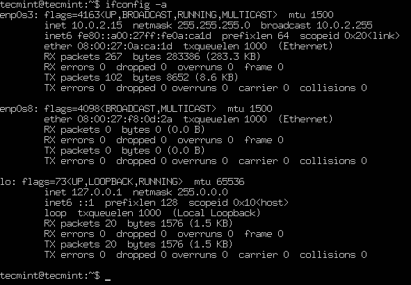
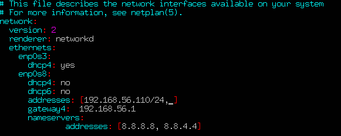

# Ubuntu 18.04配置静态网络IP地址

如何在Ubuntu 18.04中配置网络静态IP地址

在本文中，我们将解释如何使用Netplan实用程序在Ubuntu 18.04中为网络接口配置网络静态或动态IP地址。

分类: Ubuntu 操作系统

 2018-05-04 00:00:00

**Netplan**是**Ubuntu 17.10**中引入的一种新的命令行网络配置实用程序，用于在Ubuntu系统中轻松管理和配置网络设置。 它允许您使用**YAML**抽象来配置网络接口。 它可与**NetworkManager**和**systemd-networkd**网络守护程序（称为渲染程序 ，您可以选择使用其中的哪一个）一起作为内核的接口。

它读取/etc/netplan/*.yaml中描述的网络配置，并且可以将所有网络接口的配置存储在这些文件中。

在本文中，我们将解释如何使用**Netplan**实用程序在**Ubuntu 18.04**中为网络接口配置网络静态或动态IP地址。

### 列出Ubuntu上的所有活动网络接口

首先，您需要确定要配置的网络接口。 您可以使用ifconfig命令列出系统中所有连接的网络接口，如图所示。

        $ ifconfig -a

检查Ubuntu中的网络接口

从上述命令的输出中，我们有3个连接到Ubuntu系统的接口 ： 2个以太网接口和环回接口 。 但是， enp0s8以太网接口尚未配置，并且没有静态IP地址。

### 在Ubuntu 18.04中设置静态IP地址

在这个例子中，我们将为enp0s8以太网网络接口配置一个静态IP。 如图所示，使用文本编辑器打开netplan配置文件。

重要提示 ：如果YAML文件不是由发行版安装程序创建的，则可以使用此命令为渲染器生成所需的配置。

        $ sudo netplan generate 

另外，自动生成的文件可能在桌面，服务器，云实例等（例如**01-network-manager-all.yaml**或**01-netcfg.yaml **）上有不同的文件名，但是/etc/netplan/*.yaml下的所有文件将被netplan读取。

        $ sudo vim /etc/netplan/01-netcfg.yaml 

然后在ethernet部分下添加以下配置。

        enp0s8:				
        dhcp4: no
        dhcp6: no
        addresses: [192.168.56.110/24, ]
        gateway4:  192.168.56.1
        nameservers:
        addresses: [8.8.8.8, 8.8.4.4]

哪里：

    enp0s8 - 网络接口名称。
    dhcp4和dhcp6 - 接受IPv4和IPv6接口的dhcp属性。
    地址 - 接口的静态地址序列。
    gateway4 - 默认网关的IPv4地址。
    Nameservers - Nameservers的IP地址序列。 

添加完成后，您的配置文件现在应该具有以下内容，如以下屏幕截图所示。 第一个接口enp0s3配置为使用DHCP ， enp0s8将使用静态IP地址。

接口的地址属性期望有一个序列条目，例如[192.168.14.2/24，“2001：1 :: 1/64”]或[192.168.56.110/24，] （有关更多信息，请参见netplan手册页 ）。

        # This file describes the network interfaces available on your system
        # For more information, see netplan(5).
        network:
        version: 2
        renderer: networkd
        ethernets:
        enp0s3:
        dhcp4: yes
        enp0s8:
        dhcp4: no
        dhcp6: no
        addresses: [192.168.56.110/24, ]
        gateway4:  192.168.56.1
        nameservers:
        addresses: [8.8.8.8, 8.8.4.4]

在Ubuntu中配置静态IP

保存该文件并退出。 然后使用以下netplan命令应用最近的网络更改。

        $ sudo netplan apply

现在再次验证所有可用的网络接口， enp0s8以太网接口现在应连接到本地网络，并具有IP地址，如以下屏幕截图所示。

        $ ifconfig -a

在Ubuntu中验证网络接口

### 在Ubuntu中设置动态DHCP IP地址

要将enp0s8以太网接口配置为通过DHCP动态接收IP地址，只需使用以下配置即可。

        # This file describes the network interfaces available on your system
        # For more information, see netplan(5).
        network:
        version: 2
        renderer: networkd
        ethernets:
        enp0s8:
        dhcp4: yes
        dhcp6: yes

保存该文件并退出。 然后应用最近的网络更改并使用以下命令验证IP地址。

        $ sudo netplan apply
        $ ifconfig -a

从现在起，您的系统将从路由器动态获取IP地址。

你可以通过查看netplan手册页找到更多信息和配置选项。

        $ man netplan

恭喜！ 您已成功将网络静态IP地址配置到您的Ubuntu服务器。 如果您有任何疑问，请通过下面的评论表单与我们分享。
