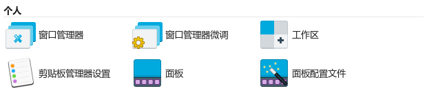
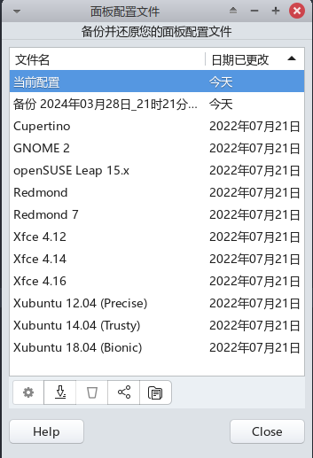

# `Xfce4`美化与配置

## 2026-01-30：

安装whisker菜单项：

```sh
sudo apt update
sudo apt install xfce4-whiskermenu-plugin
```

### 通过xfce4-panel添加Whisker菜单

如果你已经安装了`xfce4-whiskermenu-plugin`，但想要通过面板添加Whisker菜单而不是使用插件，可以按照以下步骤操作：

1. ‌**打开面板设置**‌：
   - 右键点击桌面上的任何空白区域，选择“面板”->“添加新项目”。
2. ‌**选择Whisker菜单**‌：
   - 在弹出的“添加到面板”窗口中，找到并选择“Whisker Menu”。
   - 点击“添加”按钮将其添加到面板上。
3. ‌**调整和配置**‌：
   - 添加后，你可以通过拖动来调整菜单的位置。右键点击菜单图标，选择“插件详情”来调整其设置。

---

## 1. 设置`开始`菜单

需要先安装`xfce4-panel-profiles`：

```bash
sudo apt install xfce4-panel-profiles
```
安装完成后，再次打开`设置管理器`，会多出一个选项：`面板配置文件`。如下图：


打开`面板配置文件`，就可以设定`xfce4`的`开始`菜单的风格了。可以在里面选择你想要的开始菜单风格。
如下图所示：



## 2、更改nemo文件管理器右键菜单“open in terminal”

例如要将Nemo文件管理器的右键菜单：“在终端中打开”设置为默认打开xfce4-terminal，则可以按照以下方式设置：

```sh
gsettings set org.cinnamon.desktop.default-applications.terminal exec xfce4-terminal
```

