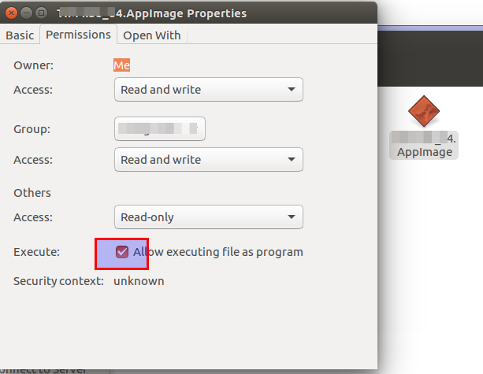

# 如何在 Ubuntu 18.04 上安装 VNote如何在 Ubuntu 18.04 上安装 VNote

VNote 是一款开源的，专为 Markdown 设计的 Vim 风格笔记应用程序。它是一款强大的 MarkDown 编辑软件，并且带有便捷的笔记管理功能，同时是一款MarkDown 体验非常棒的笔记类应用程序软件。

目前，VNote 免费，开源，可以运行于 Linux，Windows 和 macOS 的多平台笔记软件。

本篇文章主要讲解如何在 Ubuntu 18.04 上安装 VNote.
下载VNote安装包

目前官方网站提供appimage格式的安装包，可以通过以下命令下载安装包。

```
wget https://github.com/tamlok/vnote/releases/download/v2.6/VNote-2.6-x86_64.AppImage
```

编写该文章时，VNote 当前最新归档版本为2.6，如果需要下载最新的可以去VNote的GitHub地址下载。
安装AppImage格式的VNote安装包

下载完成后，进入VNote-2.6-x86_64.AppImage下载目录，使用root权限账号或者有sudo权限账号将文件设置为可执行，执行如下命令：

```
chmod +x VNote-2.6-x86_64.AppImage
```

通过在终端中使用命令运行软件，命令如下：

```
./VNote-2.6-x86_64.AppImage
```

或者通过界面操作右键->属性->权限->允许作为执行文件启动，如下图：



设置完文件可执行后，通过鼠标右键操作右键->运行。
写在最后

在本教程中，介绍了如何在 Ubuntu 18.04 上安装 VNote 的方法，希望对你有所帮助，如果你有更好的想法或建议欢迎通过留言讨论。

