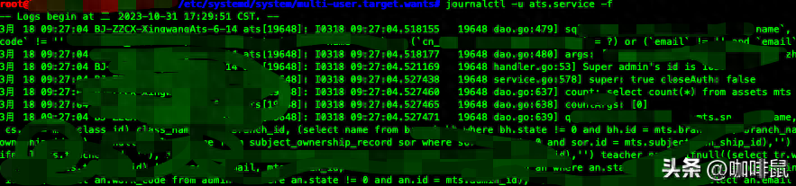

# 如何将自己的服务添加到systemctl服务管理中

Created: March 20, 2024 9:46 AM
Tags: Linux应用相关
Property 1: Jason Wang

# **第一步：创建服务单元文件**

```bash
cd /etc/systemd/system
vim /etc/systemd/system/myservice.service
```

# **第二步：编辑服务单元文件，在文件中添加以下内容**

```bash
[Unit]
Description=ATS API Server

After=syslog.target network.target

[Service]

Type=simple

WorkingDirectory=/opt/myservice/

ExecStart=/opt/service/myservice

Restart=on-failure

[Install]

WantedBy=multi-user.target
```

# **第三步：重载 systemd 管理器配置**

```bash
systemctl daemon-reload
```

# **第四步：启动服务**

```bash
systemctl start myservice.service
```

# **第五步：设置服务开机自启：**

```bash
systemctl enable myservice.service
```

# **第六步：检查服务状态：**

```bash
systemctl status myservice.service
```

# **第七步：查看服务日志**

```bash
journalctl -u ats.service -f -o json-pretty
-f 表示实时查看日志信息

-o json-pretty 表示按照json的格式输出日志
```


实时输出日志普通查看


json格式输入日志

**请将以上内容中的/opt/service/myservice 替换为自己的实际服务的路径即可**