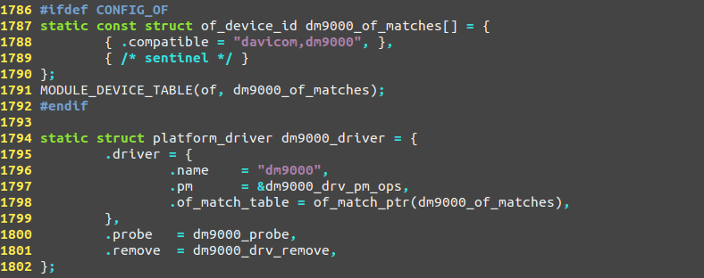
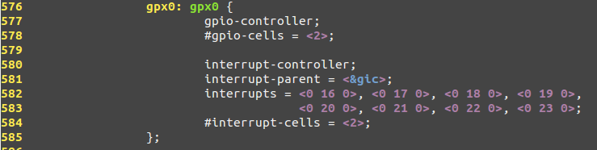
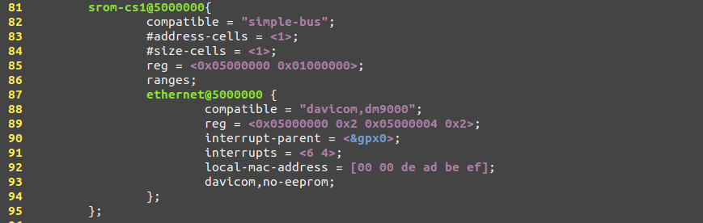

# 设备树语法详解


Linux设备树语法详解
[日期：2016-12-07] 	来源：Linux社区  作者：xiaojiang1025 	[字体：大 中 小]
概念

Linux内核从3.x开始引入设备树的概念，用于实现驱动代码与设备信息相分离。在设备树出现以前，所有关于设备的具体信息都要写在驱动里，一旦外围设备变化，驱动代码就要重写。引入了设备树之后，驱动代码只负责处理驱动的逻辑，而关于设备的具体信息存放到设备树文件中，这样，如果只是硬件接口信息的变化而没有驱动逻辑的变化，驱动开发者只需要修改设备树文件信息，不需要改写驱动代码。比如在ARM Linux内，一个.dts(device tree source)文件对应一个ARM的machine，一般放置在内核的"arch/arm/boot/dts/"目录内，比如exynos4412参考板的板级设备树文件就是"arch/arm/boot/dts/exynos4412-origen.dts"。这个文件可以通过$make dtbs命令编译成二进制的.dtb文件供内核驱动使用。

基于同样的软件分层设计的思想，由于一个SoC可能对应多个machine，如果每个machine的设备树都写成一个完全独立的.dts文件，那么势必相当一些.dts文件有重复的部分，为了解决这个问题，Linux设备树目录把一个SoC公用的部分或者多个machine共同的部分提炼为相应的.dtsi文件。这样每个.dts就只有自己差异的部分，公有的部分只需要"include"相应的.dtsi文件, 这样就是整个设备树的管理更加有序。我这里用`Linux4.8.5源码自带的dm9000网卡为例来分析设备树的使用和移植。这个网卡的设备树节点信息在"Documentation/devicetree/bindings/net/davicom-dm9000.txt"有详细说明，其网卡驱动源码是"drivers/net/ethernet/davicom/dm9000.c"。

设备树框架

设备树用树状结构描述设备信息，它有以下几种特性

    每个设备树文件都有一个根节点，每个设备都是一个节点。
    节点间可以嵌套，形成父子关系，这样就可以方便的描述设备间的关系。
    每个设备的属性都用一组key-value对(键值对)来描述。
    每个属性的描述用;结束

所以，一个设备树的基本框架可以写成下面这个样子

```
/{                                  //根节点
    node1{                          //node1是节点名，是/的子节点
        key=value;                  //node1的属性
        ...
        node2{                      //node2是node1的子节点
            key=value;              //node2的属性
            ...
        }
    }                               //node1的描述到此为止
    node3{
        key=value;
        ...
    }
}
```

节点名

理论个节点名只要是长度不超过31个字符的ASCII字符串即可，此外
Linux内核还约定设备名应写成形如<name>[@<unit_address>]的形式，其中name就是设备名，unit_address就是设备地址，如果有应该写上，下面就是典型节点名的写法


Linux中的设备树还包括几个特殊的节点，比如chosen，chosen节点不描述一个真实设备，而是用于firmware传递一些数据给OS，比如bootloader传递内核启动参数给内核


引用

当我们找一个节点的时候，我们必须书写完整的节点路径，这样当一个节点嵌套比较深的时候就不是很方便，所以，设备树允许我们用下面的形式为节点标注引用(起别名)，借以省去冗长的路径。这样就可以实现类似函数调用的效果。编译设备树的时候，相同的节点的不同属性信息都会被合并到设备节点中，而相同的属性会被覆盖，使用引用可以避免移植者四处找节点，直接在板级.dts增改即可。


下面的例子中就是直接引用了dtsi中的一个节点，并向其中添加/修改新的属性信息


KEY

在设备树中，键值对是描述属性的方式，比如，Linux驱动中可以通过设备节点中的"compatible"这个属性查找设备节点。
Linux设备树语法中定义了一些具有规范意义的属性，包括：compatible, address, interrupt等，这些信息能够在内核初始化找到节点的时候，自动解析生成相应的设备信息。此外，还有一些Linux内核定义好的，一类设备通用的有默认意义的属性，这些属性一般不能被内核自动解析生成相应的设备信息，但是内核已经编写的相应的解析提取函数，常见的有 "mac_addr"，"gpio"，"clock"，"power"。"regulator" 等等。
compatible

设备节点中对应的节点信息已经被内核构造成struct platform_device。驱动可以通过相应的函数从中提取信息。compatible属性是用来查找节点的方法之一，另外还可以通过节点名或节点路径查找指定节点。dm9000驱动中就是使用下面这个函数通过设备节点中的"compatible"属性提取相应的信息，所以二者的字符串需要严格匹配。



address

(几乎)所有的设备都需要与CPU的IO口相连，所以其IO端口信息就需要在设备节点节点中说明。常用的属性有

    #address-cells，用来描述子节点"reg"属性的地址表中用来描述首地址的cell的数量，
    #size-cells，用来描述子节点"reg"属性的地址表中用来描述地址长度的cell的数量。

有了这两个属性，子节点中的"reg"就可以描述一块连续的地址区域。下例中，父节点中指定了"#address-cells = <2>" "#size-cells = <1>"，则子节点dev-bootscs0中的reg中的前两个数表示一个地址，最后的0x4表示地址跨度是0x4


interrupts

一个计算机系统中大量设备都是通过中断请求CPU服务的，所以设备节点中就需要在指定中断号。常用的属性有

    interrupt-controller 一个空属性用来声明这个node接收中断信号
    #interrupt-cells，是中断控制器节点的属性，用来标识这个控制器需要几个单位做中断描述符,用来描述子节点中"interrupts"属性使用了父节点中的interrupts属性的具体的哪个值。一般，如果父节点的该属性的值是3，则子节点的interrupts一个cell的三个32bits整数值分别为:<中断域 中断 触发方式>,如果父节点的该属性是2，则是<中断 触发方式>
    interrupt-parent,标识此设备节点属于哪一个中断控制器，如果没有设置这个属性，会自动依附父节点的
    interrupts,一个中断标识符列表，表示每一个中断输出信号

这里，在我板子上的dm9000的的设备节点中，"interrupt-parent"使用了exynos4x12-pinctrl.dtsi（被板级设备树的exynos4412.dtsi包含）中的gpx0节点的引用，而在gpx0节点中，指定了"#interrupt-cells = <2>;"，所以在dm9000中的属性"interrupts = <6 4>;"表示指定gpx0中的属性"interrupts"中的"<0 22 0>"，通过查阅exynos4412的手册知道，对应的中断号是EINT[6]。




gpio

gpio也是最常见的IO口，常用的属性有

    "gpio-controller"，用来说明该节点描述的是一个gpio控制器
    "#gpio-cells"，用来描述gpio使用节点的属性一个cell的内容，即 属性 = <&引用GPIO节点别名 GPIO标号 工作模式>


驱动自定义key

针对具体的设备，有部分属性很难做到通用，需要驱动自己定义好，通过内核的属性提取解析函数进行值的获取，比如dm9000节点中的下面这句就是自定义的节点属性，用以表示配置EEPROM不可用。


VALUE

dts描述一个键的值有多种方式，当然，一个键也可以没有值
字符串信息

32bit无符号整型数组信息


二进制数数组


字符串哈希表


混合形式

上述几种的混合形式
设备树/驱动移植

设备树就是为驱动服务的，配置好设备树之后还需要配置相应的驱动才能检测配置是否正确。比如dm9000网卡，就需要首先将示例信息挂接到我们的板级设备树上，并根据芯片手册和电路原理图将相应的属性进行配置，再配置相应的驱动。需要注意的是，dm9000的地址线一般是接在片选线上的，我这里用的exynos4412，接在了bank1，所以是"<0x50000000 0x2 0x50000004 0x2>"
最终的配置结果是：



勾选相应的选项将dm9000的驱动编译进内核。

```
make menuconfig
[*] Networking support  --->
    Networking options  --->
        <*> Packet socket
        <*>Unix domain sockets 
        [*] TCP/IP networking
        [*]   IP: kernel level autoconfiguration
Device Drivers  --->
    [*] Network device support  --->
        [*]   Ethernet driver support (NEW)  --->
            <*>   DM9000 support
File systems  --->
    [*] Network File Systems (NEW)  --->
        <*>   NFS client support
        [*]     NFS client support for NFS version 3
        [*]       NFS client support for the NFSv3 ACL protocol extension
        [*]   Root file system on NFS
```

执行make uImage;make dtbs,tftp下载，成功加载nfs根文件系统并进入系统，表示网卡移植成功


本文永久更新链接地址：http://www.linuxidc.com/Linux/2016-12/137986.htm