# Linux文件系统之btrfs
1、初步了解

Btrfs 系统是一个有oracle研发的文件系统类型，目的在于取代ext系列的文件系统。随着网络快速发展，ext系统的文件系统确实在很多方面已经不能很好满 足需要。
核心特性：
* 多物理卷支持：btrfs可由多个底层物理卷组成；支持RAID，以联机“添加”、“移除”，“修改”；
* 写时复制更新机制(CoW)： 复制、更新及替换指针，而非“就地”更新；
* 数据及元数据校验码：checksum；
* 子卷：sub_volume；
* 快照：支持快照的快照；透明压缩。

2、进一步了解

2.1、在演示过程之前，准备工作

根据需求准备相对应数量的磁盘，尽量保持磁盘的空间大小一致的。

2.2、确认添加的硬盘都已经被系统识别
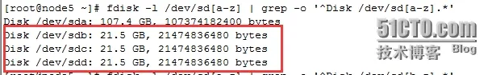

2.3、创建btrfs类型的文件系统（这里还需要提醒下，centos6上面默认是没有安装btrfs文件系统名。需要按装）
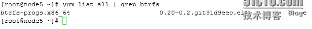

相对于创建btrfs文件系统来说很简单，只需要一条命令即可。你会发现，操作很便捷，
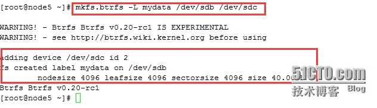

相对于btrfs命令来说，其实它可操作的选项还是比较多了！但是都不会很复杂！

2.4、确认是否创建成功，相对于确认的是否已经创建的命令太多了，如下一般：
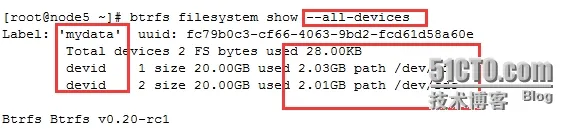

方法很多，根据需要自行选择即可
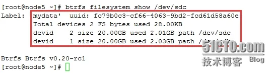

2.5、创建完成之后，可以去挂载btrfs文件系统确认是否能够正常使用
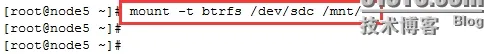

通过使用moun命令确认是否已经挂载完成

2.6、进入挂载点进行创建文件测试
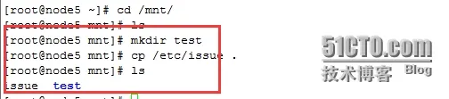

2.7、对于btrfs文件系统类型，有个地方可以关注下

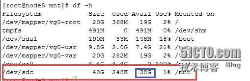

一个刚挂载的文件系统，你可以很好的发现，还没有使用的时候就一会被使用2G，这部分都被文件系统本身使用了

3、btrfs延伸部分一

3.1、如果当创建好文件系统之后，发现给的空间过多，需要缩减，那个咋办勒？？

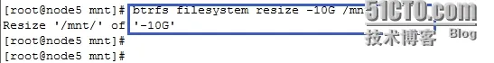

这需要这么一条命令即可，是不是感觉特别的简单，so easy的事情，相比lvm来说简单很多！对于lvm而言，如果操作不当，那么文件系统中的数据都会丢失。

确认缩减是否成功，和数据是否完整存在

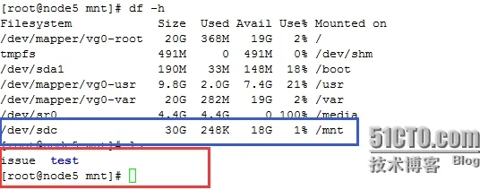

可以确定，缩减已经成功。但是还是需要提醒一点，btrfs缩减并不是没有限制的。Btrfs的缩减不能低于单块硬盘的可使用大小。否则缩减会失败。

3.2、但是如果有一天，突然之前创建的文件系统需要的空间扩容，那该咋办呢？？？

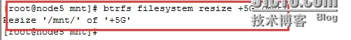

其实扩容或者缩减都很简单的事情，是需要在resize后面个{-|+}加上数字即可。其中-代表缩减；+代表扩容。但是如果在resize后面加上max，代表容量扩展最大。如下

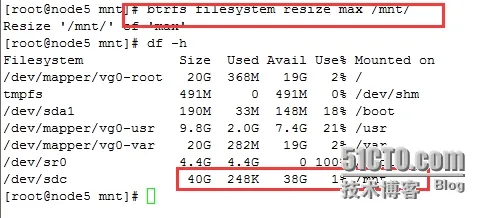

3.3、对于btrfs的空间使用情况如何，可以通过下面的命令进行查看

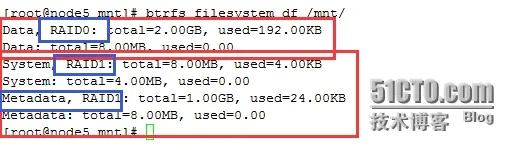

通过上面的命令能够看出，创建的文件系统btrfs，默认采用的raid分别为：数据为raid0；系统为raid1；元数据为raid1。

3.4、有一天，磁盘的空间使用满了，哪要改造咋办呢？？

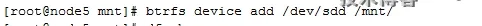

简单上面的一条命令就可，这里你是不是越发觉得，btrfs好用呢。

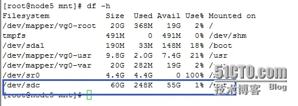

4、延伸部分二

对于btrfs系统来说，除了能够管理自身之外，还可以创建子文件系统，文件系统快照等。其实很不错了

4.1、对已btrfs文件系统来说了，其实很支持文件系统内得内容压缩机制。

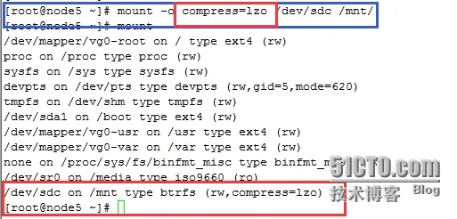

对文件系统内的数据采取lzo格式进行压缩

4.2、在btrfs创建的文件系统内，创建子文件系统

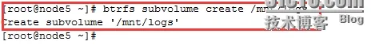

上面一条简单的命令就能创建出一个子文件系统

通过下面的命令能够对创建的是否成功进行确认

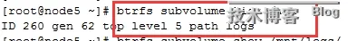

4.3、对于子文件系统来说，实际上他其实可以独立挂载的。但是有个前提，必须把父文件系统卸载，然后才能挂载，那么接下来去下载父文件系统，挂载子文件系统把

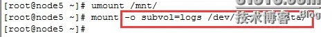

在挂载子文件系统的时候，需要注意指定子文件系统类型，

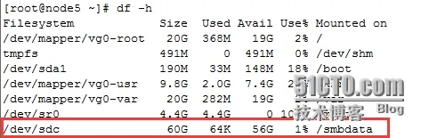

默认情况下，父文件系统空间多大，子文件系统就可以使用多少空间

挂载完成之后，接下去测试下，子文件系统是否能够正常使用。

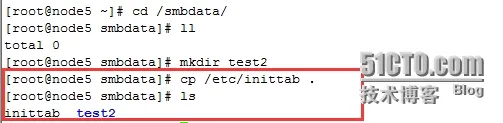

4.4、对于子文件系统来说，当父文件系统挂载之后，默认子问价系统就会被自动挂载，而之前子文件系统保存的数据并不会丢失，依然存在。如果你不信，看结果。

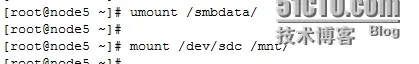

当父文件系统挂载之后，进入子文件系统查看，可以看到子文件系统的数据依然保存着

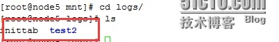

4.5、相对子文件系统来说，实际上btrfs最好的一个使用就是能够使用快照功能，当某个文件系统需要在某个实际进行备份的时候；那么快照的功能就够很好的展现其能力。

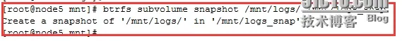

对于btrfs文件系统来说，很多都是需要一条命令就能搞定。接下去测试，看看是否如此

切换到logs子文件系统中创建一个目录

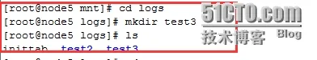

然后去之前创建的快照文件系统查看，可以确定，快照中的文件数据并没有任何变化

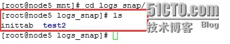

4.6、对于btrfs类型的文件系统来说，其实还可以对单个文件创造快照；

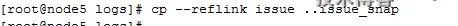

4.7、既然能够创建btrfs文件系统那么也需要能删除是吧

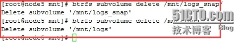

4.8、对于删除子文件系统比较简单，但是移除父的btrfs所添加的磁盘的时候，需要很小心。记得先把raid磁盘阵列的基本降低0或1基本。不然必定会出现问题。

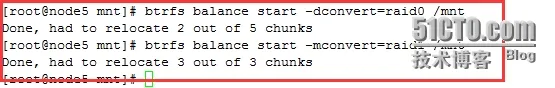

阵列的基本将下去之后，可以去移除需要移除的磁盘

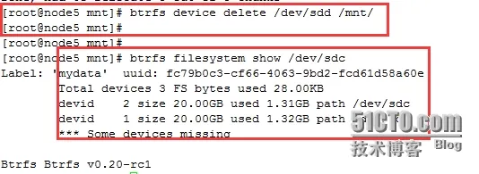

5、btrfs延伸部分三

5.1、对于btrfs文件系统来说，其实它还支持，从别的文件系统装换成btrfs文件系统；同时还能把btrfs文件系统逆转回去。

5.2、准备需要的环境，准备了一个etx4的类型的文件系统，并且已经挂载，同时在里面保存一些数据

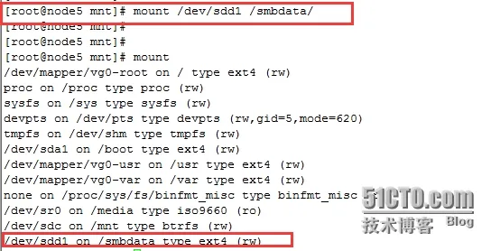

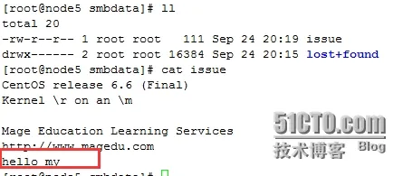

5.3、卸载以及挂载的文件系统，然后在装换成btrfs文件系统的之前还需要对其文件系统就行检查，确保文件系统没有存在文件

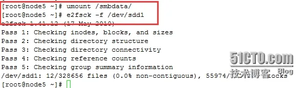

5.4、把ext4的文件系统，装换成btrfs类型的文件系统

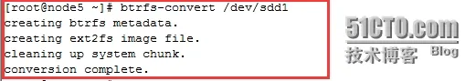

转换完成之后，进行确认是否以及完成

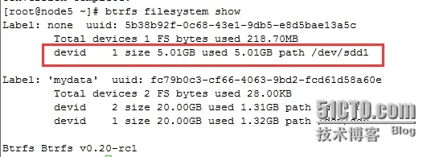

转换完成之后，去关注文件系统，进行验证文件数据是否能够正常使用

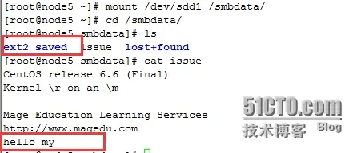

> 注意！
对于已经转换过的文件系统类型，在挂载文件系统之后，可以在内部看到一个特殊的文件`ext2_saved`，其保存了原系统的数据，建议别删除，否则不能还原到之前的系统类型

5.5、对已经转换的文件系统类型，如果挂载了，卸载，然后进行逆转，又可以回到之前的文件系统类

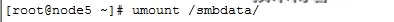

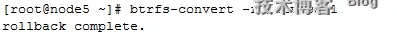

然后去确认是否已经转换回来

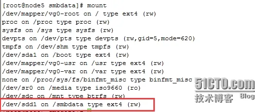

接着切换到目录中区，确认原来的数据是否准确完整

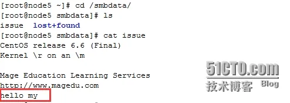