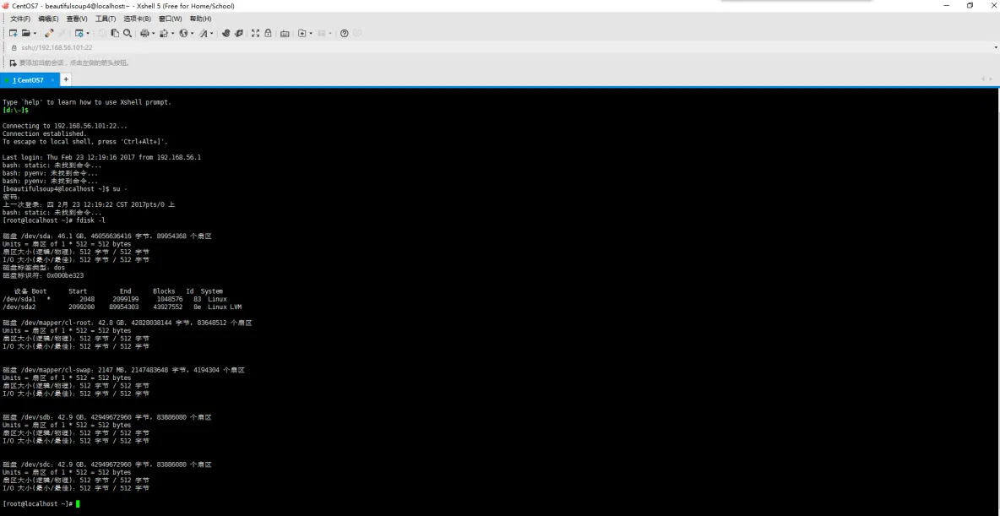
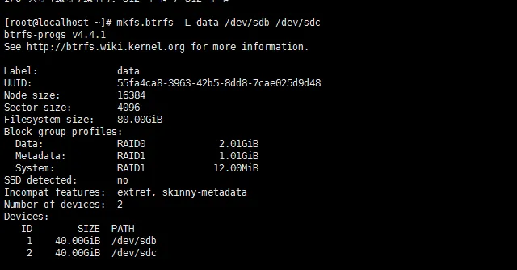
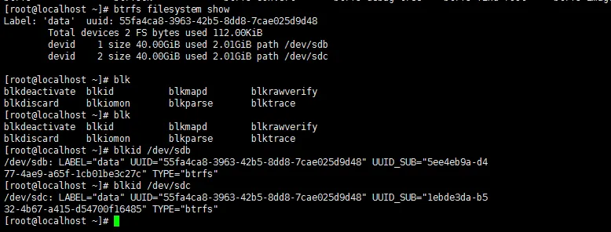
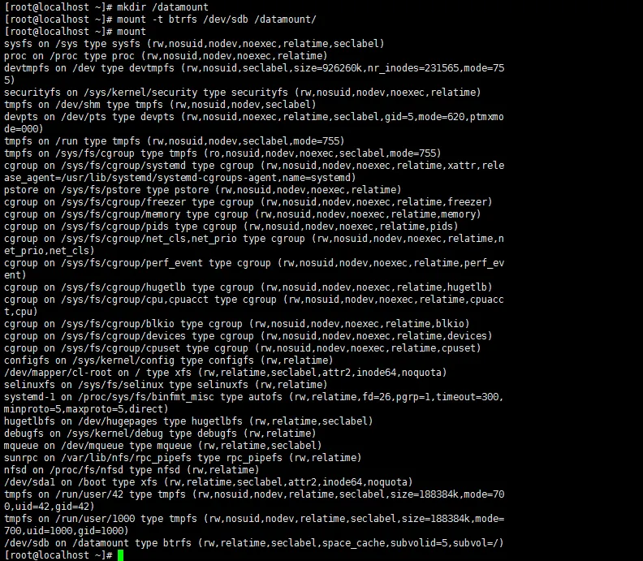
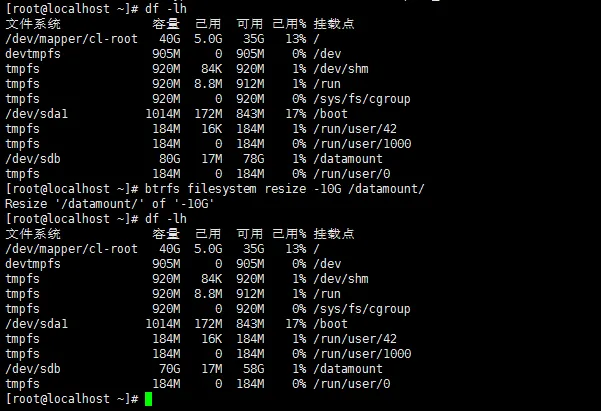

# btrfs文件系统相关
## btrfs文件系统学习
btrfs文件系统由Oracle开发，btrfs设计目标为取代早期ext文件系统。

核心特性：

1. 多物理卷支持：btrfs可由多个底层物理卷组成，支持RAID，以联机“添加”、“移除”、“修改”。

2. 写时复制更新机（COW）:复制、更新及替换指针，而非就地修改更新。

3. 数据及元数据效验码（checksum）。

4. 支持子卷（sub_volume）。

5. 快照及快照的快照。

6. 透明压缩，支持两种压缩算法lzo和zlib通过命令：

```bash
mount -o compress={lzo|zlib} DEVICE MOUNT_POINT
```

实现

那么如何创建一个btrfs文件系统呢？

可使用mkfs.btrfs命令，如果想在centos 6上使用btrfs，需要重新内核。

1. 使用fdisk硬盘分区工具查看外围设备的信息



2. 使用工具mkfs创建btrfs文件系统



3. mkfs.btrfs命令常用选项介绍:

```
-L 'LABEL'

-d <type>:存储类型

-m <profile>:元数据的存储机制

-O list-all:列出支持的所有feature(基于内核版本不同，所提供的的支持也不一样.)
```

4. 使用btrfs的子命令filesystem查看属性信息

```bash
btrfs filesystem show
```



btrfs filesystem show可以查看到此文件系统的卷标，UUID，设备等相关信息，也可使用blkid命令查看UUID

其中UUID_SUB显示的是多物理子卷的每一个物理卷的单独的UUID信息，也可使用:

```bash
btrfs filesystem show --mounted
```
显示已挂载的设备。

5. 挂载btrfs文件系统

```bash
mount -t btrfs /dev/sdb MOUNT_POINT
```


首 先创建一个挂载点，然后使用mount命令使用-t选项指明挂载文件类型，这里也可以不用指明挂载文件类型，只要blkid命令能识别就不用再指明，挂载 时指/dev/sdb或者/dev/sdc其中一个就行了，使用mount可以查看到挂载。需要卸载时可使用unmount命令。

6. 使用resize命令调整btrfs文件系统的大小



可使用
```bash
btrfs filesystem resize max /datamount
```
设置当前最大。

7. 当需要添加新的磁盘设备时使用btrfs的子命令device。

```bash
btrfs device add DEVICE
```

8. 移除某个物理卷

```bash
btrfs device delete DEVICE MOUNIT_POINT
```

9. 使用btrfs的子命令balance实现均衡操作

当文件系统拥有较多数据此时添加新的磁盘设备可使用均衡操作:

```bash
btrfs balance start MOUNT_POINT
```
其中暂停、继续等命令可参照man btrfs balance。

10. 管理子卷

* 查看子卷信息:

```bash
btrfs subvolume show [MOUNT_POINT]
```

* 显示子卷列表:

```
btrfs subvolume list[MOUNT_POINT] 
```

* 删除子卷

```bash
btrfs subvolume delete subvolume
```

* 创建子卷

```bash
btrfs subvolume create [-i <qgroupid>] [<dest>/]<name>
```

* 创建子卷快照(必须在同一个父卷中)

```bash
btrfs subvolume snapshot
```

* 创建单个文件的快照

```bash
cp --reflink FILE PATH
```

* 挂载子卷

```
mount -o subvol=subvolume DEVICE MOUNT_POINT
```

* 举例说明：

以我的OpenSUSE Tumbleweed上的btrfs文件系统举例，其设备号在Debian12下显示为/dev/sdj，我先挂载根设备：

```bash
sudo mount -t btrfs /dev/sdj /mnt
```

接下来可以查看这个btrfs文件系统下的子卷的信息：

```bash
sudo btrfs subvolume list /mnt
```

其显示如下：

```bash
ID 256 gen 30 top level 5 path @
ID 257 gen 1136 top level 256 path @/var
ID 258 gen 1104 top level 256 path @/usr/local
ID 259 gen 1129 top level 256 path @/srv
ID 260 gen 1134 top level 256 path @/root
ID 261 gen 740 top level 256 path @/opt
ID 262 gen 1142 top level 256 path @/home
ID 263 gen 25 top level 256 path @/boot/grub2/x86_64-efi
ID 264 gen 61 top level 256 path @/boot/grub2/i386-pc
ID 265 gen 1129 top level 256 path @/.snapshots
ID 266 gen 1141 top level 265 path @/.snapshots/1/snapshot
ID 267 gen 60 top level 265 path @/.snapshots/2/snapshot
ID 269 gen 118 top level 265 path @/.snapshots/4/snapshot
ID 270 gen 300 top level 265 path @/.snapshots/5/snapshot
ID 304 gen 566 top level 265 path @/.snapshots/37/snapshot
ID 305 gen 677 top level 265 path @/.snapshots/38/snapshot
ID 312 gen 754 top level 265 path @/.snapshots/45/snapshot
ID 313 gen 906 top level 265 path @/.snapshots/46/snapshot
ID 316 gen 913 top level 265 path @/.snapshots/49/snapshot
ID 317 gen 945 top level 265 path @/.snapshots/50/snapshot
ID 318 gen 970 top level 265 path @/.snapshots/51/snapshot
ID 319 gen 978 top level 265 path @/.snapshots/52/snapshot
ID 326 gen 1094 top level 265 path @/.snapshots/53/snapshot
ID 327 gen 1096 top level 265 path @/.snapshots/54/snapshot
ID 328 gen 1107 top level 265 path @/.snapshots/55/snapshot
ID 329 gen 1112 top level 265 path @/.snapshots/56/snapshot
ID 330 gen 1115 top level 265 path @/.snapshots/57/snapshot
ID 331 gen 1128 top level 265 path @/.snapshots/58/snapshot

```
上面显示以“@”打头的均为子卷。例如我想将home子卷挂载过来，可以执行以下命令：

```bash
sudo mount -o subvol=@/home UUID=bbc1f757-0170-4129-8282-d0d90df50d9e /tmp
```

`UUID=bbc1f757-0170-4129-8282-d0d90df50d9e`是btrfs盘的gpt分区的guid编号，可以通过以下命令查到：

```bash
$ sudo btrfs filesystem show --mounted
Label: none  uuid: bbc1f757-0170-4129-8282-d0d90df50d9e
	Total devices 1 FS bytes used 8.39GiB
	devid    1 size 257.99GiB used 12.02GiB path /dev/sdj2

```

11. 如何将ext文件系统转换为btrfs

如果需要转换的ext文件系统已挂载需先卸载(文件系统格式转换做联机操作相当危险)。卸载的命令：
```bash
unmount MOUNT_POINT
```

使用fsck强制检测：
```bash
fsck -f DEVICE
```

然后转换为btrfs文件系统：
```bash
btrfs-convert DEVICE
```
如果转换完成后想要回滚到之前的状态，执行以下命令：

```
btrfs-convert -r /dev/sdXX
```

