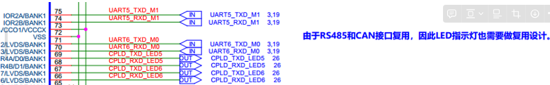
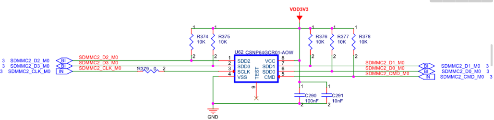

# ECU-4000S调试记录


# 采用5.10.110内核调试记录：

---

## 1. 千兆以太网连接后总是出现link down又link up的问题：

### 1.1. 计算收发延时时间

参照官方的文档：《Rockchip_Developer_Guide_Linux_GMAC_RGMII_Delayline_CN.pdf》，可以调试一下GMAC的tx和rx的delay值：

1）重启系统，拔掉GMAC网口上的网线，等待系统起来以后，运行以下命令：

```bash
root@ECU-4000S:~# cd /sys/devices/platform/fe010000.ethernet/
root@ECU-4000S:/sys/devices/platform/fe010000.ethernet# echo 1000 > phy_lb_scan
```

此时系统会自动侦测GMAC的delay值，显示如下：

```bash
[   32.879032] Delayline scan speed set to 1000thernet# echo 1000 > phy_lb_scan  
[   33.347465] dwmac4: Master AXI performs any burst length
[   33.547773] RX(-01):        O OOOOOOOOOOOOOOOOOOOOOOOOOOOOOOOOOOOOOOOOOOOOOOOOOOOOOOOOOOOOOOOOOOOOOOOOOOOOOOOO                                      
[   33.628745] Find available tx_delay = 0x30, rx_delay = disable
[   33.778681] YT8531S Ethernet stmmac-1:00: LED0 config reg: 0xc670
[   33.779046] YT8531S Ethernet stmmac-1:00: LED1 config reg: 0xc670
[   33.779677] YT8531S Ethernet stmmac-root@E1CU-4000S:/s:ys/devices/platfo0rm/fe010000.ethernet# 0: LED2 config reg: 0xc040
[   33.780024] YT8531S Ethernet stmmac-1:00: SYNCE_CFG reg: 0xf8
[   33.780614] YT8531S Ethernet stmmac-1:00: SYNCE_CFG reg: 0xf8
[   33.780795] YT8531S Ethernet stmmac-1:00: YT8521S_MASTER_SLAVE_CONTROL_REG: 0
[   33.782207] rk_gmac-dwmac fe010000.ethernet eth0: yt8521_config_init done, phy addr: 0, strap mode = 2, polling mode = 3
[   33.782892] rk_gmac-dwmac fe010000.ethernet eth0: PHY [stmmac-1:00] driver [YT8531S Ethernet] (irq=POLL)
[   33.786777] dwmac4: Master AXI performs any burst length
[   33.786844] rk_gmac-dwmac fe010000.ethernet eth0: No Safety Features support found
[   33.786910] rk_gmac-dwmac fe010000.ethernet eth0: IEEE 1588-2008 Advanced Timestamp supported
[   33.787709] rk_gmac-dwmac fe010000.ethernet eth0: registered PTP clock
[   33.787773] rk_gmac-dwmac fe010000.ethernet eth0: configuring for phy/rgmii-rxid link mode
[   38.899454] vcc3v3_lcd1_n: disabling
```

其中的：

```bash
Find available tx_delay = 0x30, rx_delay = disable
```

表示tx_delay的值为：0x30，将其填入到dtb文件中即可。

### 1.2. 问题定位，是裕泰微电子PHY驱动的问题：

需要修改PHY驱动代码：

```c
static int yt8521_read_status(struct phy_device *phydev)
{
	int ret;
	volatile int val;
	volatile int val1;
	volatile int yt8521_fiber_latch_val;
	volatile int yt8521_fiber_curr_val;
	volatile int link;
	int link_utp = 0, link_fiber = 0;
//	int i = 0;

	if (YT8521_PHY_MODE_CURR != YT8521_PHY_MODE_FIBER) {
		/* reading UTP */
		ret = ytphy_write_ext(phydev, 0xa000, 0);
		if (ret < 0)
			return ret;

//		for (i = 0; i < 5; i++) {
//			val = phy_read(phydev, REG_PHY_SPEC_STATUS);
//			if (val < 0)
//				return val;
//			mdelay(100);
//		}


		//读3遍状态寄存器 
                val = phy_read(phydev, REG_PHY_SPEC_STATUS);
                if (val < 0)                                
                        return val;                         
                                                            
                mdelay(100);

                val1 = phy_read(phydev, REG_PHY_SPEC_STATUS);
                if (val1 < 0)
                        return val1;

//		mdelay(100);
//		val = phy_read(phydev, REG_PHY_SPEC_STATUS);
//                if (val < 0)
//                        return val;

		while (val != val1) {
			val = phy_read(phydev, REG_PHY_SPEC_STATUS);
			if (val < 0)                                
				return val;                         
								    
			mdelay(100);

			val1 = phy_read(phydev, REG_PHY_SPEC_STATUS);
			if (val1 < 0)
				return val1;
		}

```

增加上面代码中的：

```c
while (val != val1) {
			val = phy_read(phydev, REG_PHY_SPEC_STATUS);
			if (val < 0)                                
				return val;                         
								    
			mdelay(100);

			val1 = phy_read(phydev, REG_PHY_SPEC_STATUS);
			if (val1 < 0)
				return val1;
}
```

意思是：两次读取寄存器的值需要相等，如果不等，则继续比较，知道相等为止。

# V3.0版本调试记录20240415：

## 1. 硬件改动：

### 1.1. 硬件设计原理图：

[ECU-4000S_SCH_V3.0_20240304.pdf](file:///media/sf_D_DRIVE/BaiduNetdiskWorkspace/Rockchip_20220520/ECU-4000S_20230620/V3.0_20240304/SCH/ECU-4000S_SCH_V3.0_20240304.pdf)

### 1.2. 增加1路sd-nand芯片

用于将来作为一个可读写的日志分区，大小最大<font face="微软雅黑" color=yellow>**8GB**</font>。上电后可挂载至Linux系统下的`/log`分区下。

该分区可格式化为`btrfs`分区。这样便于对`btrfs`分区进行快照备份。

### 1.3. 增加2路CAN总线，采用CPU自带的前两路CAN控制器。

并且LED指示灯采用CPU的GPIO来显示，该显示通过CPLD内部逻辑来和最后2路RS485之间进行复用设计。

如下图：



其CPLD内部实现逻辑为：
```verilog
//---------------------------------------------------------------------------------------------------------------------------------
//	2路RS485和CAN总线接口复用指示灯逻辑。 
//  CAN总线通讯指示灯采用CPU的GPIO来实现，注意需要修改内核驱动配置和DTB设备文件树的描述
//---------------------------------------------------------------------------------------------------------------------------------
assign cpld_led_txd[5] = uart_led_txd[5] & gpio3_d_a_in[2];
assign cpld_led_rxd[5] = uart_led_rxd[5] & gpio3_d_a_in[3];
assign cpld_led_txd[6] = uart_led_txd[6] & gpio3_d_a_in[4];
assign cpld_led_rxd[6] = uart_led_rxd[6] & gpio3_d_a_in[5];
```

## 2. 软件改动

### 2.1. 增加的sd-nand采用CPU的SD-MMC2这一路功能:

如下图：



其需要修改内核设备文件树`dtb`对应的字段（文件：[<font face="微软雅黑" color=yellow>**sanway-rk3568-ecu4000s-v30-evb1-ddr4-v10.dtsi**</font>](file:///media/jason/Rockchip1/rk356x/kernel/arch/arm64/boot/dts/rockchip/sanway_ecu4000s_v30_lvds/sanway-rk3568-ecu4000s-v30-evb1-ddr4-v10.dtsi)）。
需要将`sdmmc2`修改为以下内容：

```c
&sdmmc2 {
	max-frequency = <150000000>;
	supports-sd;
	bus-width = <4>;
	
	cap-mmc-highspeed;
	cap-sd-highspeed;
	disable-wp;
	sd-uhs-sdr104;
//	broken-cd;

	// cap-sdio-irq;
	// keep-power-in-suspend;
	// mmc-pwrseq = <&sdio_pwrseq>;
	non-removable;
	vmmc-supply = <&vcc3v3_sd>;
	vqmmc-supply = <&vccio_sd>;
	pinctrl-names = "default";
	pinctrl-0 = <&sdmmc2m0_bus4 &sdmmc2m0_cmd &sdmmc2m0_clk>;	
	status = "okay";
};
```
测试：

编译内核，烧写到板子上：

```bash
dd if=boot.img_ecu4000s_hdmi of=/dev/mmcblk0p3 bs=1M
```

重启系统后如果正常，则可以看到新的eMMC设备已经被支持了：

```bash
root@SWA3568:~# dmesg |grep mmc3                                    
[    2.067006] mmc_host mmc3: card is non-removable.
[    2.139200] mmc3: new high speed SDHC card at address 1388
[    2.140266] mmcblk3: mmc3:1388 CS064 7.21 GiB 
root@SWA3568:~# 
```
<font face="微软雅黑" color=yellow>**如果要将该分区设置为btrfs分区，则需要先对其进行格式化操作**</font>

```bash
mkfs.btrfs -f /dev/mmcblk3p1 -L "LOG"
```

> <font face="微软雅黑" color=yellow>**注意：参数：-L “LOG”表示将文件分区的标识名称设置为“LOG”。**</font>

然后再进行挂载：

```bash
mount -t btrfs /dev/mmcblk3p1 /log
```

挂载后的分区信息如下:
```bash
root@SWA3568:~# mount                             
...
/dev/mmcblk3p1 on /log type btrfs (rw,relatime,ssd,space_cache,subvolid=5,subvol=/)

```

也可以用`btrfs filesystem show `来查看：
```bash
root@SWA3568:~# btrfs filesystem show LOG
Label: 'LOG'  uuid: 7def405d-afdc-46c2-992e-06e62f6e6362
        Total devices 1 FS bytes used 192.00KiB
        devid    1 size 7.21GiB used 276.00MiB path /dev/mmcblk3p1
```
使用时可以用`btrfs subvolume` 在`/log`下增加子卷。俩如建立一个叫：`tcu_log`的子卷：
```bash
btrfs subvolume create /log/tcu_log
```

查看建立的子卷：
```bash
root@SWA3568:~# btrfs subvolume list /log/
ID 257 gen 10 top level 5 path tcu_log
```

### 2.2. 增加2路CAN总线接口
内核设备文件树的改动如下：
```c
&can0 {
	assigned-clocks = <&cru CLK_CAN0>;
	//assigned-clock-rates = <150000000>;
	assigned-clock-rates = <100000000>;
	pinctrl-names = "default";
	pinctrl-0 = <&can0m0_pins>;
	status = "okay";
};

&can1 {
	assigned-clocks = <&cru CLK_CAN1>;
	//assigned-clock-rates = <150000000>;
	assigned-clock-rates = <100000000>;
	pinctrl-names = "default";
	pinctrl-0 = <&can1m0_pins>;
	status = "okay";
};

...

leds: leds {
	compatible = "gpio-leds";
	work_led: work {
		label = "heartbeat";
		//gpios = <&gpio0 RK_PA5 GPIO_ACTIVE_LOW>;
		gpios = <&gpio0 RK_PD3 GPIO_ACTIVE_LOW>;
		linux,default-trigger = "heartbeat";
		default-state = "on";
	};
	led-emmc {
		label = "mmc1_rd_wr";
		//gpios = <&gpio0 RK_PA6 GPIO_ACTIVE_LOW>;
		gpios = <&gpio0 RK_PD4 GPIO_ACTIVE_LOW>;
		//linux,default-trigger = "mmc1";
		linux,default-trigger = "mmc0";
		default-state = "on";
	};
	//2024-03-05: RAY.Wang，CPU的2路CAN总线通讯指示灯，
	//采用CAN_LED通过GPIO来trigger触发的方式。
	led-can0-tx {
		label = "can-led0-tx";
		gpios = <&gpio3 RK_PA2 GPIO_ACTIVE_LOW>;
		//linux,default-trigger = "netdev";
		linux,default-trigger = "can0-tx";
		default-state = "off";
	};
	led-can0-rx {
		label = "can-led0-rx";
		gpios = <&gpio3 RK_PA3 GPIO_ACTIVE_LOW>;
		//linux,default-trigger = "netdev";
		linux,default-trigger = "can0-rx";
		default-state = "off";
	};
	led-can1-tx {
		label = "can-led1-tx";
		gpios = <&gpio3 RK_PA4 GPIO_ACTIVE_LOW>;
		linux,default-trigger = "can1-tx";
		default-state = "off";
	};
	led-can1-rx {
		label = "can-led1-rx";
		gpios = <&gpio3 RK_PA5 GPIO_ACTIVE_LOW>;
		linux,default-trigger = "can1-rx";
		default-state = "off";
	};
};


```

但是发送/接收双色指示灯会有红色指示灯显示，改为采用rxtx一个绿色指示灯显示：
```c
led-can0-rxtx {
	label = "can-led0-rxtx";
	gpios = <&gpio3 RK_PA2 GPIO_ACTIVE_LOW>;
	//linux,default-trigger = "netdev";
	linux,default-trigger = "can0-rxtx";
	default-state = "off";
};
led-can1-rxtx {
	label = "can-led1-rxtx";
	gpios = <&gpio3 RK_PA4 GPIO_ACTIVE_LOW>;
	linux,default-trigger = "can1-rxtx";
	default-state = "off";
};		
```

修改`rc.user`启动脚本，增加CAN初始化脚本：

```bash
		echo "Setting CAN bus Baudrate..."
		ip link set can0 down
		ip link set can1 down
#		ip link set can2 down
#		ip link set can3 down
#		ip link set can4 down
#		ip link set can5 down

		ip link set can0 type can bitrate $CAN_BITRATE0 dbitrate $CAN_BITRATE0 fd on 
		ip link set can1 type can bitrate $CAN_BITRATE1 dbitrate $CAN_BITRATE1 fd on 
#		ip link set can2 type can bitrate $CAN_BITRATE2 dbitrate $CAN_BITRATE2 fd on
#		ip link set can3 type can bitrate $CAN_BITRATE3
#		ip link set can4 type can bitrate $CAN_BITRATE4
#		ip link set can5 type can bitrate $CAN_BITRATE5

		# ip link set can0 up
		# ip link set can1 up
#		ip link set can2 up
#		ip link set can3 up
#		ip link set can4 up
#		ip link set can5 up

```

> <font face="微软雅黑" color=yellow>**注意：默认CAN初始化波特率后并没有打开CAN设备，原因是采用GPIO方式来点指示灯的话，如果打开CAN设备，则指示灯会常亮。因此默认是关闭指示灯常亮。**</font>

# V2.0版本调试即修改记录20240126：

## 1、硬件上增加了4G模块：

1.1、硬件设计原理图：

[ECU-4000S_SCH_V2.0_20240105.pdf](file:///media/sf_D_DRIVE/BaiduNetdiskWorkspace/Rockchip_20220520/ECU-4000S_20230620/V2.0_20240105/SCH/ECU-4000S_SCH_V2.0_20240105.pdf)

1.2、设计中采用了<font face="微软雅黑" color=yellow>**GW1N-UV2LQ100C6I5**</font>这款CPLD器件，相应的CPLD程序也需要修改：

[ecu4000s_cpld_20240202.tar.gz](file:///media/sf_D_DRIVE/BaiduNetdiskWorkspace/Rockchip_20220520/ECU-4000S_20230620/V2.0_20240105/CPLD/ecu4000s_cpld_20240202.tar.gz)

## 2、软件需要修改的内容：

具体的修改软件目录在：
```bash
/media/jason/Rockchip1/rk356x/sanway/ecu4000s_20230720/v2.0_20240201/
```

2.1、可以增加以下脚本来识别4G模块rc.modules_4g：
```bash
#!/bin/sh

MODULE_4G_ME909S_821=2ecc:3010
MODULE_4G_EC200A_CN=2c7c:6005

check_4g_module ()
{
        if [ $# -ne 1 ]; then
                echo Error: No parameters
                return 1
        fi

        CHECK_MODULES_TYPE=`lsusb |grep "$1"`

        if [ ! -z "${CHECK_MODULES_TYPE}" ]; then
                echo Find 4G MODULE TYPE: ${CHECK_MODULES_TYPE}
                return 0
        fi

        return 1
}

run_4g_module_dialup_program ()
{
        if [ $# -eq 1 ]; then
                echo 4G module type: $1
                /usr/local/sanway/auto_pppd &                
        fi

        exit 0
}

check_4g_module ${MODULE_4G_EC200A_CN}
if [ $? -eq 0 ]; then
        run_4g_module_dialup_program EC200A_CN
fi

check_4g_module ${MODULE_4G_ME909S_821}
if [ $? -eq 0 ]; then        
        run_4g_module_dialup_program ME909S_821        
fi

exit 1
```

2.2、升级脚本：

本次升级脚本程序做了较大的改动，主要是为了考虑将来的代码复用问题，因此脚本中写了很多函数功能，如下所示：
```bash
#!/bin/sh
ARCH_SYSTEM=32bit

#内核显示模式：lvds，或者hdmi
KERNEL_DISPLAY_MODE=lvds

PARTITION_KERNEL=/dev/mmcblk0p3
PARTITION_ROOTFS=/dev/mmcblk0p6

DIR_UPDATE=./update_files
DIR_ETC=/etc
DIR_USER=/usr
DIR_USR_LIB=${DIR_USER}/lib
DIR_USR_LOCAL=${DIR_USER}/local
DIR_USR_LOCAL_SANWAY=${DIR_USR_LOCAL}/sanway
DIR_UDEV_RULESD=${DIR_ETC}/udev/rules.d
DIR_BOOT=/boot
DIR_KERNEL_MODULES=/lib/modules

FILE_IMAGE_KERNEL=boot.img_ecu4000s_${KERNEL_DISPLAY_MODE}
FILE_LOCAL_EXTRA_RULES=localextra.rules
FILE_LOCAL_RULES=local.rules
FILE_TTS_RULES=tts.rules
FILE_LTEUSB_RULES=lteusb.rules
FILE_HOST_NAME=hostname
FILE_ISSUE=issue

#检测文件系统是否为64位，或者32位
check_rootfs_64bit()
{
        CHECK_SYSTEM_BITS=`strings /lib/libc.so.6 |grep armhf`

        if [[ -z "$CHECK_SYSTEM_BITS" ]]; then
                echo ROOTFS is 64bit system!                
                return 1
        else
                echo ROOTFS is 32bit system!                
                return 0
        fi
}

check_file_exist()
{
        if [ $# -ne 1 ]
        then
                echo Error: No paramter! You must specify 1 paramter.
                exit 1
        fi

        if [ ! -f $1 ]; then
                echo File: $1 is not exist!
                exit 1
        fi

        #echo File: $1 is OK.
        return 0
}

check_directory_exist()
{
        if [ $# -ne 1 ]
        then
                echo Error: No paramter! You must specify 1 paramter.
                exit 1
        fi

        if [ ! -d $1 ]; then
                echo DIR: $1 is not exist!
                exit 1
        fi

        #echo DIR: $1 is OK.
        return 0
}

check_block_device_exist()
{
        if [ $# -ne 1 ]
        then
                echo Error: No paramter! You must specify 1 paramter.
                exit 1
        fi

        if [ ! -b $1 ]; then
                echo Device block: $1 is not exist!
                exit 1
        fi

        #echo Device block: $1 is OK.
        return 0
}

check_char_device_exist()
{
        if [ $# -ne 1 ]
        then
                echo Error: No paramter! You must specify 1 paramter.
                exit 1
        fi

        if [ ! -c $1 ]; then
                echo Device char: $1 is not exist!
                exit 1
        fi

        #echo Device char: $1 is OK.
        return 0
}

#擦除并烧写NAND
erase_and_write_nand()
{

        if [ ! -f $2 ]; then
                echo File: $2 is not exist!
                return 1
        fi

        echo Erasing $1 ...
        flash_erase $1 0 0

        if [ $? -ne 0 ]; then
                echo Erasing $1 failed.
                exit 1
        fi

        echo Write $2 to $1 ...
        nandwrite -p $1 $2

        if [ $? -ne 0 ]; then
                echo Write $2 to $1 failed.
                exit 1
        fi

}

#采用dd命令烧写eMMC分区
#参数1为需要烧写的文件名，参数2为eMMC分区编号，如mmcblk0p3等
erase_and_write_emmc()
{
        if [ $# -ne 2 ]
        then
                echo Error: No paramter! You must specify 2 paramter.
                exit 1
        fi

        # if [ ! -f $1 ]; then
                # echo File: $1 is not exist!
                # exit 1
        # fi
        
        # if [ ! -f $2 ]
        # then
                # echo Device: $2 is not exist!
                # exit 1
        # fi

        check_block_device_exist $2
        check_file_exist $1
        
        echo Writing $1 to $2 ...
        dd if=$1 of=$2 bs=1M

        if [ $? -ne 0 ]; then
                echo Writing $1 failed.
                exit 1
        fi

        echo Writing $1 to $2 succeeded!
        return 0
}

#复制文件：需要2个参数$1和$2
update_files()
{
        check_directory_exist $2
        check_file_exist $1        

        echo Copying file: $1 to $2 ...
        cp -raf $1 $2

        if [ $? -ne 0 ]; then
                echo Copying file $1 failed.
                exit 1
        fi

        echo Copying file $1 suceeded!
}

#复制文件：需要2个参数$1和$2
update_tar_bag()
{                                                            
        check_directory_exist $2
        check_file_exist $1        

        echo Extracting TAR bag file: $1 to dir: $2 ...
        tar xzvf $1 -C $2

        if [ $? -ne 0 ]; then
                echo Extracting TAR bag file $1 to dir: $2 failed.
                exit 1
        fi

        echo Extracting TAR bag file $1 to dir: $2 suceeded!
}

#############################################################################
#       脚本主程序开始
#############################################################################

#检测脚本参数，该参数作为内核烧写版本的区别：lvds或者hdmi
if [ $# -eq 1 ]
then
        KERNEL_DISPLAY_MODE=$1                
fi

if [[ "${KERNEL_DISPLAY_MODE}" != "lvds" && "${KERNEL_DISPLAY_MODE}" != "hdmi" ]]
then
        echo Error: Parameter KERNEL_DISPLAY_MODE must be: lvds or hdmi.
        exit 1
fi

FILE_IMAGE_KERNEL=boot.img_ecu4000s_${KERNEL_DISPLAY_MODE}
echo Kernel image name: ${FILE_IMAGE_KERNEL}

#检测文件系统是32位还是64位
check_rootfs_64bit
#echo "function check_rootfs_64bit return val: $?"
if [ $? -eq 0 ]; then
        ARCH_SYSTEM=32bit
        #echo File system is: ${ARCH_SYSTEM}
        #echo TAR bag is updating now ...
        #exit 0
else
        ARCH_SYSTEM=64bit
        #echo File system is: ${ARCH_SYSTEM}
        #echo Update TAR bag can only used for 32bit system!
        #exit 1
fi

echo Starting update now ...
echo File system is: ${ARCH_SYSTEM}
sleep 1

#更新文件
update_files ${DIR_UPDATE}/${FILE_LOCAL_EXTRA_RULES} ${DIR_UDEV_RULESD}
update_files ${DIR_UPDATE}/${FILE_LOCAL_RULES} ${DIR_UDEV_RULESD}
update_files ${DIR_UPDATE}/${FILE_TTS_RULES} ${DIR_UDEV_RULESD}
update_files ${DIR_UPDATE}/${FILE_LTEUSB_RULES} ${DIR_UDEV_RULESD}
update_files ${DIR_UPDATE}/${FILE_HOST_NAME} ${DIR_ETC}
update_files ${DIR_UPDATE}/${FILE_ISSUE} ${DIR_ETC}

#更新tar包
TAR_BAG_LIB_CPLD=lib_cpld_ecu4000s_${ARCH_SYSTEM}.tar.gz
TAR_BAG_SANWAY=sanway_ecu4000s_v20_20240202.tar.gz
TAR_BAG_KERNEL_MODULES=4.19.232_modules_rk3568j_ecu4000s_20240202.tar.gz

update_tar_bag ${DIR_UPDATE}/${ARCH_SYSTEM}/${TAR_BAG_LIB_CPLD} ${DIR_USR_LIB}

rm -rf ${DIR_USR_LOCAL_SANWAY}
update_tar_bag ${DIR_UPDATE}/${ARCH_SYSTEM}/${TAR_BAG_SANWAY} ${DIR_USR_LOCAL}

#更新内核模块文件
update_tar_bag ${DIR_UPDATE}/${TAR_BAG_KERNEL_MODULES} ${DIR_KERNEL_MODULES}
depmod -a

#烧写新的内核
erase_and_write_emmc ${DIR_UPDATE}/${FILE_IMAGE_KERNEL} ${PARTITION_KERNEL}

sync
sleep 1
echo Updating succeeded! You should rebooting system ...
```

# V1.0版本调试记录：

## 1、开发相关资料：

[ECU-4000S_SCH_V10_20230701.pdf](file:///media/sf_D_DRIVE/BaiduNetdiskWorkspace/Rockchip_20220520/ECU-4000S_20230620/V10_20230620/SCH_20230701/ECU-4000S_SCH_V10_20230701.pdf)

CPLD程序包：

[CPLD.rar](https://s3-us-west-2.amazonaws.com/secure.notion-static.com/924fd98c-358e-4e82-b28e-3935f7ec7310/CPLD.rar)

CPLD烧写固件（高云CPLD：<font face="微软雅黑" color=yellow>GW1N-UV2LQ100C6/I5</font>）：

[ecu4000s.fs](https://s3-us-west-2.amazonaws.com/secure.notion-static.com/dfbce361-c4b3-4c27-9ea2-89382d2198c5/ecu4000s.fs)

动态库及示例程序：

[动态库及示例程序.tar.gz](https://s3-us-west-2.amazonaws.com/secure.notion-static.com/0e2eb522-58cc-4bf4-95d8-ff77c723a4f2/%E5%8A%A8%E6%80%81%E5%BA%93%E5%8F%8A%E7%A4%BA%E4%BE%8B%E7%A8%8B%E5%BA%8F.tar.gz)

## 2、烧写：

要在`SWM4696`的基础上进行更新升级。文件烧写包：[ecu4000s_20230719](file:///media/sf_H_DRIVE/各个型号板卡的烧写文件备份_20211115/RK3568系列板卡_20220929/ecu4000s_20230719)

## 3、问题：


> <font face="微软雅黑" color=red>**CPU自带的千兆网口总是出现连接断开，然后又连上的现象，并且出现这种情况后，再ping的时候就会出现卡顿的现象。**</font>


感觉像是因为设置为`UTP/FIBER`自动检测模式带来的影响。于是修改`YT8531S`的驱动，将驱动设置为`UTP only`模式：

```c
/* support automatically check polling mode for yt8521
 * for Fiber only system, please define YT8521_PHY_MODE_CURR 1
 * for UTP only system, please define YT8521_PHY_MODE_CURR 2
 * for combo system, please define YT8521_PHY_MODE_CURR 3
 */
...

//#define YT8521_PHY_MODE_CURR    yt8521_hw_strap_polling(phydev)
#define YT8521_PHY_MODE_CURR    YT8521_PHY_MODE_UTP
```

驱动默认支持的是自动检测外部接口媒介是`UTP`还是`FIBER`，现在改为`UTP only`模式，重新编译并烧写内核。现象没有再出现。

> <font face="微软雅黑" color=red>**千兆以太网的DTB配置说明**</font>

由于硬件上已经设计了2ns的接收延时，因此在`DTB`中就需要将软件添加的接收延时去掉，此时需要：

```c
// phy-mode = "rgmii";
phy-mode = "rgmii-rxid";

...

tx_delay = <0x3a>;
// rx_delay = <0x29>;
```

> <font face="微软雅黑" color=red>**调试万力达1280x1024的液晶屏分辨率：**</font>

1）参照以下这篇文章：

[RK3568如何固定HDMI 分辨率输出](http://www.360doc.com/content/22/0926/09/29321110_1049372494.shtml)

按照上述的文章描述修改之后，会出现以下2点问题：

* <font face="微软雅黑" color=cyan>**可以启动，但是重启后屏幕背景变为绿色。**</font>
* <font face="微软雅黑" color=cyan>**用HDMI-DVI显示线连接液晶屏，屏幕分辨率可以为1280x1024。但是用HDMI-HDMI显示线连接液晶屏，就不能正确分辨。**</font>

> <font face="微软雅黑" color=red>**万力达需要64位文件系统**</font>

1）第一步，可以先烧写WLD-8610L的固件，然后再上传我的更新包文件：[update_ecu4000s_64bit.tar.gz](http://my.zhwld.com:6680/enterprise/dashboard/projects/enterprise/SW-WLD/tree/master/RK3568J/ECU4000S/%E7%B3%BB%E7%BB%9F%E7%83%A7%E5%86%99%E6%9B%B4%E6%96%B0%E6%96%87%E4%BB%B6%E5%8C%85)

- 注意：现在万力达这边采用的码云（gitee）的代码管理系统，需要登录去下载包文件。
  
    ```
    用户名：walei163@hotmail.com，    
    密码：sanway1929
    ```
    

**更新方法：**

```
文件中包含了内核影像，模块文件，启动脚本，和一些必须的更新文件。
更新方法：
1、首先需要烧写WLD-8610L的64位文件系统，以此作为底包，并在此基础上进行更新。

2、烧写完WLD-8610L的系统后，重启装置，然后用SFTP将更新包文件：update_ecu4000s_64bit.tar.gz上传到装置中。

SFTP和ssh的用户名和密码均为：root。

3、上传完成后，再ssh登录到装置系统下，然后解压更新包文件：

tar xzvf update_ecu4000s_64bit

4、进入解压缩后的目录，运行更新脚本：
cd update_ecu4000s_64bit
./update.sh

等待更新完成，然后重启系统即可。

```
<font face="微软雅黑" color=yellow>**注意：更新包中已经包含了内核影像的更新，因此不需要再用瑞星微的RKDevTool.exe工具单独更新内核了。**</font>
因为文件系统变成了64位文件系统，因此在编译程序时，需要注意使用的编译器。我们现在支持两种编译器：

- armhf的32位编译器。例如：`arm-linux-gnueabihf-gcc`
- aarch64的64位编译器。例如：`aarch64-linux-gnu-gcc`

为了便于编译程序，可以在编译的脚本中做以下的改动。

- 对于`shell`脚本，可以参照以下代码格式设计：

```bash
CROSS_COMPILE_PATH=/media/jason/develop/ma35d1/gcc-linaro-13.0.0-2022.11-x86_64_aarch64-linux-gnu/bin
ARCH=arm64

if [ "$1" = "$ARCH" ]
then
	CROSS_COMPILE=${CROSS_COMPILE_PATH}/aarch64-linux-gnu-
	CXX=${CROSS_COMPILE}g++
  CC=${CROSS_COMPILE}gcc
else
	CROSS_COMPILE=arm-none-linux-gnueabihf-
	CXX=${CROSS_COMPILE}g++
  CC=${CROSS_COMPILE}gcc
fi
```

- 对于`Makefile`文件，可以参照以下代码格式设计：
```bash
#CROSS_COMPILE_PATH=/media/jason/Rockchip1/rk356x/prebuilts/gcc/linux-x86/aarch64/gcc-linaro-6.3.1-2017.05-x86_64_aarch64-linux-gnu/bin
CROSS_COMPILE_PATH=/media/jason/develop/ma35d1/gcc-linaro-13.0.0-2022.11-x86_64_aarch64-linux-gnu/bin
ifeq ($(ARCH), arm64)
	CROSS_COMPILE=${CROSS_COMPILE_PATH}/aarch64-linux-gnu-
	CXX=${CROSS_COMPILE}g++	
else
	CROSS_COMPILE=arm-none-linux-gnueabihf-
	CXX=${CROSS_COMPILE}g++
endif
```

- 以一个实际的脚本文件举例说明：

```bash
#!/bin/sh

#CROSS_COMPILE_PATH=/media/jason/Rockchip1/rk356x/prebuilts/gcc/linux-x86/aarch64/gcc-linaro-6.3.1-2017.05-x86_64_aarch64-linux-gnu/bin
CROSS_COMPILE_PATH=/media/jason/develop/ma35d1/gcc-linaro-13.0.0-2022.11-x86_64_aarch64-linux-gnu/bin
ARCH=arm64

if [ "$1" = "$ARCH" ]
then
	CROSS_COMPILE=${CROSS_COMPILE_PATH}/aarch64-linux-gnu-
	CXX=${CROSS_COMPILE}g++
        CC=${CROSS_COMPILE}gcc
else
	CROSS_COMPILE=arm-none-linux-gnueabihf-
	CXX=${CROSS_COMPILE}g++
        CC=${CROSS_COMPILE}gcc
fi

echo ./make_arm_libso $1
./make_arm_libso $1

echo ${CC} -L./ -DDEBUG test_cpld.c -o test_cpld -lcpld
${CC} -L./ -DDEBUG test_cpld.c -o test_cpld -lcpld
```