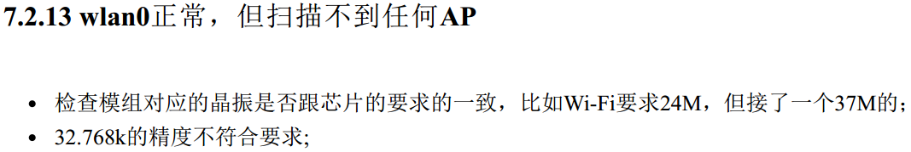

# WLD-8610L[MAIN]-2308 V2.00
## 更新记录

### 2024-04-18
#### 1. 无线模块AP6212调试：

##### 1.1. 官方基于`AP6212`模块调试的文档：
  
[Rockchip_Developer_Guide_Linux_WIFI_BT_CN.pdf](file:///media/jason/Rockchip1/rk356x/docs/Linux/Wifibt/Rockchip_Developer_Guide_Linux_WIFI_BT_CN.pdf)

##### 1.2. `AP6212`数据手册和参考设计：

* 参考设计：
[AP6212_REF_DESIGN_V1.0_20240417.pdf](file:///media/sf_D_DRIVE/BaiduNetdiskWorkspace/硬件资料/以太网相关/WIFI模块/AP6212/AP6212_REF_DESIGN_V1.0_20240417.pdf)

* 数据手册：
[AP6212 datasheet_V1.2_11262014.pdf](file:///media/sf_D_DRIVE/BaiduNetdiskWorkspace/硬件资料/以太网相关/WIFI模块/AP6212/AP6212%20datasheet_V1.2_11262014.pdf)

##### 1.3. 万力达图纸中有错误的地方需要修改：    

* `WL_RST`和`BT_RST`这两个信号需要接CPU的`GPIO`；否则系统启动时`WIFI`初始化会失败。

当前调试时的修改方案：
        
    1）去掉U28：74LVC08；
    2）从CON1B接插件上的195脚飞线至U28的第8脚，197脚飞线至U28的第11脚。
    这样做是为了将CPU的GPIO连接到AP6212的：WL_REG_ON和BT_RST_N这2个脚上，便于CPU来控制AP6212。

* 编号：`X3`的无源晶振的频率需要从<font face="微软雅黑" color=yellow>**37.4MHz**</font>改为<font face="微软雅黑" color=yellow>**26MHz**</font>。否则可能将会导致如下问题：

    


##### 1.4. Linux内核修改：

* 修改DTB设备文件树：[wld-8610-2307-evb.dtsi](file:///media/jason/Rockchip1/rk356x/kernel/arch/arm64/boot/dts/rockchip/wanlida/wld-8610-2307-evb.dtsi)

```c
sdio_pwrseq: sdio-pwrseq {
	compatible = "mmc-pwrseq-simple";
	clocks = <&rk809 1>;
	clock-names = "ext_clock";
	pinctrl-names = "default";
	pinctrl-0 = <&wifi_enable_h>;
	/*
	 * On the module itself this is one of these (depending
	 * on the actual card populated):
	 * - SDIO_RESET_L_WL_REG_ON
	 * - PDN (power down when low)
	 */
	//reset-gpios = <&gpio3 RK_PD5 GPIO_ACTIVE_LOW>;
	reset-gpios = <&gpio3 RK_PA2 GPIO_ACTIVE_LOW>;
};

wireless_wlan: wireless-wlan {
	compatible = "wlan-platdata";
	rockchip,grf = <&grf>;
	// wifi_chip_type = "ap6398s";
	wifi_chip_type = "ap6212";
	sdio_vref= <3300>;
	//WIFI,host_wake_irq = <&gpio0 RK_PC5 GPIO_ACTIVE_HIGH>;  // WIFI_WAKE_HOST
	WIFI,host_wake_irq = <&gpio0 RK_PC5 GPIO_ACTIVE_HIGH>;  // WIFI_WAKE_HOST
	status = "okay";
};

wireless_bluetooth: wireless-bluetooth {
	compatible = "bluetooth-platdata";
	clocks = <&rk809 1>;
	clock-names = "ext_clock";
	wifi-bt-power-toggle;
	// uart_rts_gpios = <&gpio2 RK_PB1 GPIO_ACTIVE_LOW>;
	// pinctrl-names = "default", "rts_gpio";
	// pinctrl-0 = <&uart8m0_rtsn>;
	// pinctrl-1 = <&uart8_gpios>;
	//BT,reset_gpio    = <&gpio3 RK_PA0 GPIO_ACTIVE_HIGH>;
	// BT,wake_gpio     = <&gpio3 RK_PA1 GPIO_ACTIVE_HIGH>;
	// BT,wake_host_irq = <&gpio3 RK_PA2 GPIO_ACTIVE_HIGH>;
	BT,reset_gpio    = <&gpio3 RK_PA4 GPIO_ACTIVE_HIGH>;
	BT,wake_gpio     = <&gpio0 RK_PC6 GPIO_ACTIVE_HIGH>;
	BT,wake_host_irq = <&gpio0 RK_PC2 GPIO_ACTIVE_HIGH>;
	status = "okay";
};

...

&pinctrl {
    ...
    
    sdio-pwrseq {
	    wifi_enable_h: wifi-enable-h {
		    //rockchip,pins = <3 RK_PD5 RK_FUNC_GPIO &pcfg_pull_none>;
		    rockchip,pins = <3 RK_PA2 RK_FUNC_GPIO &pcfg_pull_none>;
	    };
    };
    
    ...
}

```
具体修改说明可参见1.1节官方文档。

* 修改DTB设备文件树：[wld-8610-2307-evb1-ddr4-v10.dtsi](file:///media/jason/Rockchip1/rk356x/kernel/arch/arm64/boot/dts/rockchip/wanlida/wld-8610-2307-evb1-ddr4-v10.dtsi)

```c
&sdmmc2 {
	max-frequency = <150000000>;
	supports-sdio;
	bus-width = <4>;
	disable-wp;
	cap-sd-highspeed;
	cap-sdio-irq;
	keep-power-in-suspend;
	mmc-pwrseq = <&sdio_pwrseq>;
	non-removable;
	pinctrl-names = "default";
	pinctrl-0 = <&sdmmc2m0_bus4 &sdmmc2m0_cmd &sdmmc2m0_clk>;
	sd-uhs-sdr104;
	status = "okay";
};
```

并且还需要将`gmac0`用于复位控制的GPIO注释掉（因为我们控制`AP6212`用到了`GPIO3_A2`）：

```c
&gmac0 {
    ...

    // snps,reset-gpio = <&gpio3 RK_PA2 GPIO_ACTIVE_LOW>;
    // snps,reset-active-low;
    /* Reset time is 20ms, 100ms for rtl8211f */
    // snps,reset-delays-us = <0 20000 100000>;
    
    ...   
    
}
```

> <font face="微软雅黑" color=yellow>**注意：`AP6212`采用`SDIO`接口模式。如果是基于`USB`接口的`WIFI`模块，则不能采用该方案。**</font>

* 配置编译内核：

```
Device Drivers  --->
    [*] Network device support  ---> 
        [*]   Wireless LAN  --->
            <*>   Rockchip Wireless LAN support  --->
                [*]   build wifi ko modules
                [*]   Wifi load driver when kernel bootup
                [ ]   Wifi generate random mac address and save to vendor storage for cob chip
                [*]   Broadcom Wireless Device Driver Support  --->
                    <M>   Select driver version for ap6xxx chips 
                    <M>     stable version (wifi5)
                    < >     support wifi6(80211ax) 
                    < >     support WiFi keepalive during host shutdown
                    (/vendor/etc/firmware/fw_bcmdhd.bin) Firmware path
                    (/vendor/etc/firmware/nvram.txt) NVRAM path
                    [ ]   Enable wlan1 support
```

> <font face="微软雅黑" color=yellow>**注意：AP6212模块需要加载固件：`fw_bcmdhd.bin`和`nvram.txt`才能运行。**</font>
> <font face="微软雅黑" color=yellow>**这两个文件被内核默认配置到`/vendor/etc/firmware/`目录下。**</font>
> <font face="微软雅黑" color=yellow>**固件可以从RK官方SDK包获取：**</font>
[firmware固件](file:///media/jason/Rockchip1/rk356x/external/rkwifibt/firmware/broadcom/AP6212A1/)
> <font face="微软雅黑" color=yellow>**获取之后需要将固件名称改为和内核配置时的名称完全一致，然后上传到装置对应的目录下：`/vendor/etc/firmware/`**</font>
    
##### 1.5. 配置并测试WIFI

* 使用 `wpa_passphrase `工具生成 WIFI的配置文件。运行该命令之后需要输入WIFI的连接密码。

```bash
root@fsmp1a:# wpa_passphrase "你的 WiFi SSID" > wifi.conf
```

* 连接WIFI：

```bash
root@fsmp1a:# wpa_supplicant -B -c wifi.conf -i wlan0
```
* 配置 WiFi 网络

```bash
root@fsmp1a:# udhcpc -i wlan0
root@fsmp1a:# echo "nameserver 114.114.114.114" > /etc/resolv.conf
root@fsmp1a:# echo "nameserver 8.8.8.8" >> /etc/resolv.conf
root@fsmp1a:# ping -c 4 www.baidu.com
```

如果一切顺利，则如下图所示：


### 2024-03-18
万力达硬件版本更新到：**`WLD-8610L[MAIN]-2308 V2.00`**，
图纸：[WLD-8610L[MAIN]-2307 V2.00.pdf](file:///media/jason/Rockchip1/rk356x/sanway/珠海万力达_20230717/WLD-8610L[MAIN]-2307%20V2.00_20230823/WLD-8610L[MAIN]-2307%20V2.00.pdf)

4G模块需要从鼎桥`ME909s-805p`替换为移远模块：`EC200A-CN`。需要修改4G拨号程序代码。
修改后的更新压缩包：[update_4g_EC200A_20240319.tar.gz](file:///media/jason/Rockchip1/rk356x/sanway/珠海万力达_20230717/WLD-8610L[MAIN]-2307%20V2.00_20230823/烧写文件/update_4g_EC200A_20240319.tar.gz)

<mark>修改说明</mark>
```text
1、update_4g.tar.gz:
	用于更新4G板子上的4G模块通讯及掉线检测功能。
	直接将update_4g.tar.gz通过SFTP（SSH）上传：用户名：root，密码：zhwld
	解压缩包后运行update_4g目录下的update.sh，等待升级完成，重启系统即可。
	
2、2024-03-18:
update_4g_EC200A_20240318.tar.gz：
	更新了程序，可以同时支持移远EC200A-CN模块，和鼎桥ME909s-805p模块。
	更新方法同1。
	
3、2024-03-19:
update_4g_EC200A_20240319.tar.gz：
	新增脚本：rc.module_4g，用于打开4G模块对应的GPIO电源使能脚（掉电后重新上电需要将4G模块的电源使能脚打开），
	和写入模块的USB ID到内核中。
	更新方法同1。
```
---
其中，`rc.module_4g`脚本代码如下:
```bash
#!/bin/sh

MODULE_4G_ME909S_821=2ecc:3010
MODULE_4G_EC200A_CN=2c7c:6005

check_4g_module ()
{
        if [ $# -ne 1 ]; then
                echo Error: No parameters
                exit 1
        fi

        CHECK_MODULES_TYPE=`lsusb |grep "$1"`

        if [ -z "${CHECK_MODULES_TYPE}" ]; then
                echo Not find 4G module: $1
                return 1
        fi

        echo Find 4G MODULE TYPE: ${CHECK_MODULES_TYPE}
        return 0
}

run_autopppd()
{
        sleep 1
        ./auto_pppd &
}

run_4g_module_power()
{
        GPIO3_A6_NUMBER=102
        GPIO3_A7_NUMBER=103

        if [ -d /sys/class/gpio/gpio${GPIO3_A7_NUMBER} ]; then
                echo out > /sys/class/gpio/gpio${GPIO3_A7_NUMBER}/direction
        else
                echo ${GPIO3_A7_NUMBER} > /sys/class/gpio/export
                echo ${GPIO3_A6_NUMBER} > /sys/class/gpio/export

                echo out > /sys/class/gpio/gpio${GPIO3_A7_NUMBER}/direction

                #echo Setting GPIO3_d_A7 failed.
                #exit 1
        fi

        GPIO3_A7_DIR=`cat /sys/class/gpio/gpio${GPIO3_A7_NUMBER}/direction`
        echo ${GPIO3_A7_DIR}

        if [ "${GPIO3_A7_DIR}" = "out" ]; then
                echo 1 > /sys/class/gpio/gpio${GPIO3_A7_NUMBER}/value
                echo Setting GPIO3_d_A7 succeded!                
        else
                echo Setting GPIO3_d_A7 direction failed.
                exit 1
        fi
}

check_4g_module_delay()
{
        #set i=0
        for (( i=0; i<30; i++ ))
        do
                check_4g_module $1
                if [ $? -eq 0 ]; then                
                        return 0
                fi
                sleep 1                
        done

        return 1
}

run_4g_module_power
#sleep 15

# check_4g_module_delay ${MODULE_4G_ME909S_821}
# if [ $? -eq 0 ]; then
        # run_autopppd
        # echo Found MODULE_4G_ME909S_821!
        # exit 0
# fi

check_4g_module_delay ${MODULE_4G_EC200A_CN}
if [ $? -eq 0 ]; then
        echo Found MODULE_4G_EC200A_CN!
	    echo "2c7c 6005 ff" >  /sys/bus/usb-serial/drivers/option1/new_id
        run_autopppd        
        exit 0        
fi

```