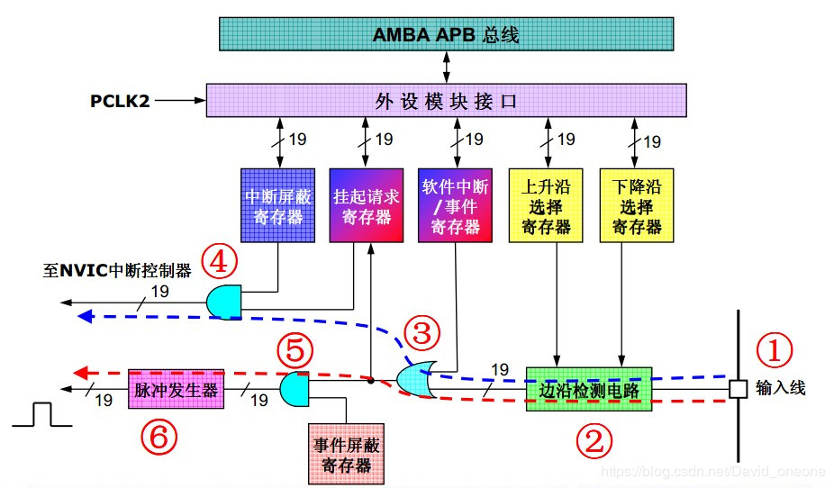
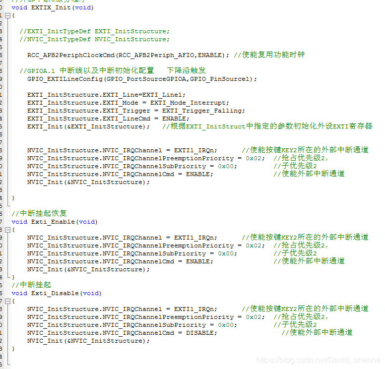
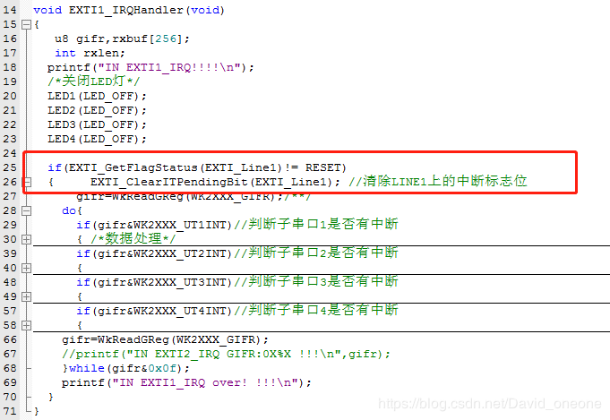
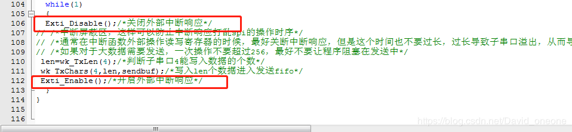

# STM32边沿触发中断与电平触发中断的匹配

STM32的中断涉及的内容比较多，我们今天仅仅说明不同中断触发类型之间的匹配。STM32外部中断的触发方式都是边沿触发，如下：

       EXTI_Trigger_Rising = 0x08,
       EXTI_Trigger_Falling = 0x0C,  
       EXTI_Trigger_Rising_Falling = 0x10

 

但是目前有些芯片或者设备的中断输出方式是电平触发或者电平输出，那么和STM32的中断的边沿触发方式有些不一样，这两种中断方式有什么不一样那？

我们也低电平触发和下降沿触发为例，讲解一些。

1. 有些电平触发的芯片，一个中断输出引脚，可能对应几种中断事件可，标识为A、B、C  .当中断A产生以后，输出低电平，这个时候B也刚刚好产生，那么中断输出，肯定还是保持低电平不变，

2. 如果电平触发中断，在不想中断处理的情况下，可以屏蔽中断，再次打开中断的时候，只要对应的中断硬件是低，那么依然能再次进入中断响应函数。如果是边沿触发的确是不行，因为在屏蔽期间如果错过边沿，那么就不能再进入中断，造成中断函数不能再响应。

为了解决上面的问题，我们先分析STM32的中断结构

我们看看STM32中断触发到相应的结构：

 这张图是一条外部中断线或外部事件线的示意图，图中信号线上划有一条斜线,旁边标志19字样的注释，表示这样的线路共有19套。

图中的蓝色虚线箭头，标出了外部中断信号的传输路径，首先外部信号从编号1的芯片管脚进入，经过编号2的边沿检测电路，通过编号3的或门进入中断挂起请求寄存器，

最后经过编号4的与门输出到NVIC中断检测电路，这个边沿检测电路受上升沿或下降沿选择寄存器控制，用户可以使用这两个寄存器控制需要哪一个边沿产生中断，

因为选择上升沿或下降沿是分别受2个平行的寄存器控制，所以用户可以同时选择上升沿或下降沿，而如果只有一个寄存器控制，那么只能选择一个边沿了。

按下来是编号3的或门，这个或门的另一个输入是软件中断/事件寄存器，从这里可以看出，软件可以优先于外部信号请求一个中断或事件，即当软件中断/事件寄存器的对应位为”1”时，
不管外部信号如何，编号3的或门都会输出有效信号。

一个中断或事件请求信号经过编号3的或门后，进入挂起请求寄存器，到此之前，中断和事件的信号传输通路都是一致的，也就是说，挂起请求寄存器中记录了外部信号的电平变化。

外部请求信号最后经过编号4的与门，向NVIC中断控制器发出一个中断请求，如果中断屏蔽寄存器的对应位为”0”，则该请求信号不能传输到与门的另一端，实现了中断的屏蔽。

解决办法：

        1、进入中断函数，尽可能把中断处理完，让中断引脚恢复高电平。
        2、在屏蔽中断期间，我们应该采用中断挂起的方式，仅仅是不响应中断，但是能接收中断引脚电平变化，当出了屏蔽区以后，可以继续响应中断。

具体的操作代码如下：

中断文件：

使用的时候：

中断响应函数：

代码屏蔽区：需要挂起中断，

————————————————
版权声明：本文为CSDN博主「David_oneone」的原创文章，遵循 CC 4.0 BY-SA 版权协议，转载请附上原文出处链接及本声明。
原文链接：https://blog.csdn.net/david_oneone/java/article/details/95070138