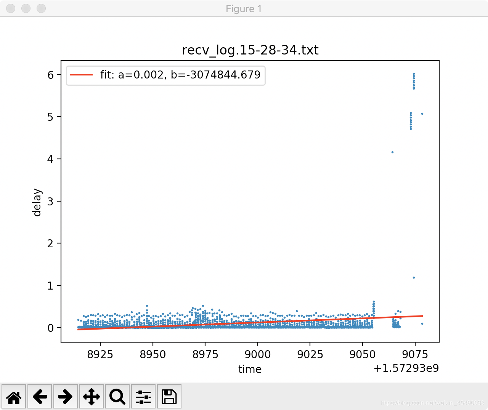

# ptpd2的使用

ptpd2的使用
探花_ 2019-11-06 10:03:57 375 收藏 2
展开

#### 文章目录

        功能介绍
        编译
        使用
        实验结果

#### 功能介绍

ptpd2是实现了ptp协议的一个用于本地局域网内的多台设备间的时间戳同步的工具。
为什么要做时间戳同步？

    需要测试一个大包从开始发送到完成接收时，延时的时间
    问题在于发送开始是发送端才能感知的，接收结束是接收端感知的，
    这就需要发送端和接收端的时间戳同步
    当然如果发送方每个包都不存在排队的情况，即每个包发送的时间和对端接收的时间几乎相等，那也可以不考虑时间戳同步

#### 编译

项目源码：https://github.com/ptpd/ptpd
安装说明查看根目录下的INSTALL文件即可，如果是交叉编译需要指定交叉编译工具链的位置和host类型，比如：

        ./configure CC=/opt/tuya/rts3903/toolchain/rsdk-4.8.5-5281-EL-3.10-u0.9.33-m32fut-161202/bin/mips-linux-uclibc-gcc --host=mips

 
编译完成后在src目录下会生成一个ptpd2的文件

#### 使用

需要在多台设备上同时运行ptpd2，而且关闭本地的网络时间同步功能。多台设备间会选举出一个master设备，其他设备同步master设备上的时间戳
运行命令：

        ./ptpd2 -C -m -i 网卡

效果如下：
master

        ./ptpd2 -C -m -i enp0s9
        2019-11-05 15:51:27.209776 ptpd2[28013].startup (notice)    (___) PTPd version 2.3.2 starting
        2019-11-05 15:51:27.210028 ptpd2[28013].startup (info)      (___) Starting ptpd2 daemon with parameters:      ./ptpd2 -C -m -i enp0s9
        2019-11-05 15:51:27.210137 ptpd2[28013].startup (info)      (___) Checking configuration
        2019-11-05 15:51:27.211055 ptpd2[28013].startup (info)      (___) Configuration OK
        2019-11-05 15:51:27.211625 ptpd2[28013].startup (info)      (___) Successfully acquired lock on /var/run/ptpd2.lock
        2019-11-05 15:51:27.211830 ptpd2[28013].startup (notice)    (___) PTPd started successfully on enp0s9 using "masterslave" preset (PID 28013)
        2019-11-05 15:51:27.211901 ptpd2[28013].startup (info)      (___) TimingService.PTP0: PTP service init
        2019-11-05 15:51:27.212993 ptpd2[28013].enp0s9 (info)      (init) Observed_drift loaded from kernel: 0 ppb
        2019-11-05 15:51:27.330706 ptpd2[28013].enp0s9 (notice)    (lstn_init) Now in state: PTP_LISTENING
        2019-11-05 15:51:37.212943 ptpd2[28013].enp0s9 (notice)    (lstn_init) TimingService.PTP0: elected best TimingService
        2019-11-05 15:51:37.213050 ptpd2[28013].enp0s9 (info)      (lstn_init) TimingService.PTP0: acquired clock control
        2019-11-05 15:51:39.330991 ptpd2[28013].enp0s9 (notice)    (mst) Now in state: PTP_MASTER, Best master: 080027fffe9b75e6(unknown)/1 (self)

slave

        ./ptpd2 -C -m -i wlan0
        2019-11-05 15:27:51.786437 ptpd2[14978].startup (notice)    (___) PTPd version 2.3.2 starting
        2019-11-05 15:27:51.791273 ptpd2[14978].startup (info)      (___) Starting ptpd2 daemon with parameters:      ./ptpd2 -C -m -i wlan0
        2019-11-05 15:27:51.792204 ptpd2[14978].startup (info)      (___) Checking configuration
        2019-11-05 15:27:51.805501 ptpd2[14978].startup (info)      (___) Configuration OK
        2019-11-05 15:27:51.813856 ptpd2[14978].startup (info)      (___) Successfully acquired lock on /var/run/ptpd2.lock
        2019-11-05 15:27:51.823630 ptpd2[14978].startup (notice)    (___) PTPd started successfully on wlan0 using "masterslave" preset (PID 14978)
        2019-11-05 15:27:51.830361 ptpd2[14978].startup (info)      (___) TimingService.PTP0: PTP service init
        2019-11-05 15:27:51.841379 ptpd2[14978].wlan0 (info)      (init) Observed_drift loaded from kernel: 500000 ppb
        2019-11-05 15:27:51.954576 ptpd2[14978].wlan0 (notice)    (lstn_init) Now in state: PTP_LISTENING
        2019-11-05 15:27:53.124398 ptpd2[14978].wlan0 (info)      (lstn_init) New best master selected: 080027fffe9b75e6(unknown)/1
        2019-11-05 15:27:53.125152 ptpd2[14978].wlan0 (notice)    (slv) Now in state: PTP_SLAVE, Best master: 080027fffe9b75e6(unknown)/1 (IPv4:192.168.0.123)
        2019-11-05 15:27:53.129399 ptpd2[14978].wlan0 (notice)    (slv) Received first Sync from Master
        2019-11-05 15:27:54.150012 ptpd2[14978].wlan0 (notice)    (slv) Servo: Going to slew the clock with the maximum frequency adjustment
        2019-11-05 15:27:54.358795 ptpd2[14978].wlan0 (notice)    (slv) Received first Delay Response from Master
        2019-11-05 15:28:01.838415 ptpd2[14978].wlan0 (notice)    (slv) TimingService.PTP0: elected best TimingService
        2019-11-05 15:28:01.838939 ptpd2[14978].wlan0 (info)      (slv) TimingService.PTP0: acquired clock control
        2019-11-05 15:31:05.146610 ptpd2[14978].wlan0 (notice)    (mst) Now in state: PTP_MASTER, Best master: 68572dfffe180489(unknown)/1 (self)
        2019-11-05 15:31:07.064538 ptpd2[14978].wlan0 (info)      (mst) New best master selected: 080027fffe9b75e6(unknown)/1
        2019-11-05 15:31:07.065183 ptpd2[14978].wlan0 (notice)    (slv) Now in state: PTP_SLAVE, Best master: 080027fffe9b75e6(unknown)/1 (IPv4:192.168.0.123)
        2019-11-05 15:31:08.083974 ptpd2[14978].wlan0 (notice)    (slv) Received first Sync from Master
        2019-11-05 15:31:18.120349 ptpd2[14978].wlan0 (notice)    (slv) Received first Delay Response from Master
        2019-11-05 15:31:19.070627 ptpd2[14978].wlan0 (notice)    (mst) Now in state: PTP_MASTER, Best master: 68572dfffe180489(unknown)/1 (self)
        2019-11-05 15:31:19.139458 ptpd2[14978].wlan0 (info)      (mst) New best master selected: 080027fffe9b75e6(unknown)/1
        2019-11-05 15:31:19.140088 ptpd2[14978].wlan0 (notice)    (slv) Now in state: PTP_SLAVE, Best master: 080027fffe9b75e6(unknown)/1 (IPv4:192.168.0.123)
        2019-11-05 15:31:19.141485 ptpd2[14978].wlan0 (notice)    (slv) Received first Sync from Master
        2019-11-05 15:31:19.143962 ptpd2[14978].wlan0 (notice)    (slv) Servo: Going to slew the clock with the maximum frequency adjustment
        2019-11-05 15:31:28.143317 ptpd2[14978].wlan0 (notice)    (slv) Received first Delay Response from Master
        2019-11-05 15:36:39.229007 ptpd2[14978].wlan0 (notice)    (slv) Servo: Going to slew the clock with the maximum frequency adjustment
        2019-11-05 15:51:37.222877 ptpd2[14978].wlan0 (notice)    (mst) Now in state: PTP_MASTER, Best master: 68572dfffe180489(unknown)/1 (self)
        2019-11-05 15:51:41.392391 ptpd2[14978].wlan0 (info)      (mst) New best master selected: 080027fffe9b75e6(unknown)/1
        2019-11-05 15:51:41.393819 ptpd2[14978].wlan0 (notice)    (slv) Now in state: PTP_SLAVE, Best master: 080027fffe9b75e6(unknown)/1 (IPv4:192.168.0.123)
        2019-11-05 15:51:41.407142 ptpd2[14978].wlan0 (notice)    (slv) Received first Sync from Master
        2019-11-05 15:51:41.408630 ptpd2[14978].wlan0 (notice)    (slv) Servo: Going to slew the clock with the maximum frequency adjustment
        2019-11-05 15:51:43.228221 ptpd2[14978].wlan0 (notice)    (slv) Received first Delay Response from Master
        2019-11-05 15:56:41.415663 ptpd2[14978].wlan0 (notice)    (slv) Servo: Going to slew the clock with the maximum frequency adjustment
        2019-11-05 15:59:52.691385 ptpd2[14978].wlan0 (critical)  (slv) Offset above 1 second (1.255948392 s). Clock will step.
        2019-11-05 15:59:51.437358 ptpd2[14978].wlan0 (warning)   (slv) Stepped the system clock to: 11/05/19 15:59:51.436959403
        2019-11-05 15:59:51.550478 ptpd2[14978].wlan0 (notice)    (lstn_reset) Now in state: PTP_LISTENING
        2019-11-05 15:59:52.248959 ptpd2[14978].wlan0 (info)      (lstn_reset) New best master selected: 080027fffe9b75e6(unknown)/1
        2019-11-05 15:59:52.249716 ptpd2[14978].wlan0 (notice)    (slv) Now in state: PTP_SLAVE, Best master: 080027fffe9b75e6(unknown)/1 (IPv4:192.168.0.123)
        2019-11-05 15:59:53.271045 ptpd2[14978].wlan0 (notice)    (slv) Received first Sync from Master
        2019-11-05 15:59:53.281309 ptpd2[14978].wlan0 (critical)  (slv) Offset above 1 second (-1.061708814 s). Clock will step.
        2019-11-05 15:59:54.352946 ptpd2[14978].wlan0 (warning)   (slv) Stepped the system clock to: 11/05/19 15:59:54.352556613
        2019-11-05 15:59:54.464142 ptpd2[14978].wlan0 (notice)    (lstn_reset) Now in state: PTP_LISTENING
        2019-11-05 15:59:55.152467 ptpd2[14978].wlan0 (info)      (lstn_reset) New best master selected: 080027fffe9b75e6(unknown)/1
        2019-11-05 15:59:55.153135 ptpd2[14978].wlan0 (notice)    (slv) Now in state: PTP_SLAVE, Best master: 080027fffe9b75e6(unknown)/1 (IPv4:192.168.0.123)
        2019-11-05 15:59:55.154501 ptpd2[14978].wlan0 (notice)    (slv) Received first Sync from Master
        2019-11-05 15:59:56.188955 ptpd2[14978].wlan0 (notice)    (slv) Received first Delay Response from Master
        2019-11-05 16:00:08.293429 ptpd2[14978].wlan0 (notice)    (slv) Servo: Going to slew the clock with the maximum frequency adjustment

 
 
#### 实验结果

这张图是在收端采集到的时延画的图，还是很准确的，没有一个值小于0，而且比较集中。

-------------
探花原创
————————————————
版权声明：本文为CSDN博主「探花_」的原创文章，遵循CC 4.0 BY-SA版权协议，转载请附上原文出处链接及本声明。
原文链接：https://blog.csdn.net/weixin_45490038/java/article/details/102929369