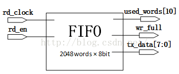
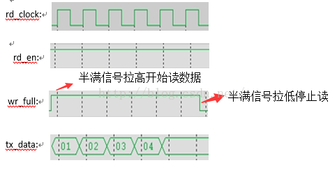
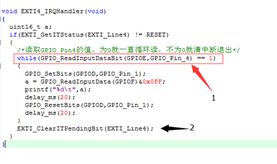
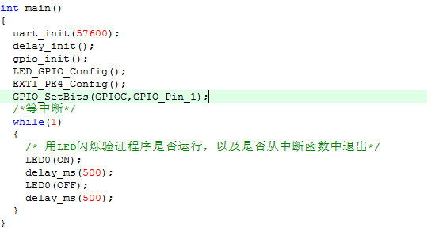
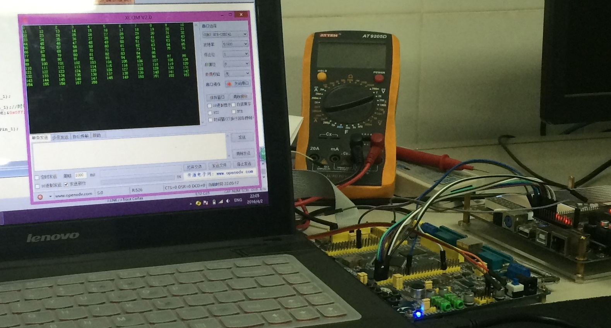

# stm32中断无电平触发的解决办法

这几天在用stm32读取FPGA中FIFO里的数据，遇到了不少的问题。这里就其中的一个问题写写，比较简单，就当做是打发一下时间。

　　问题就是，stm32的中断没有电平触发方式。stm32读取FIFO中的数据，当FIFO数据非空时给stm32中断信号——将对应的中断线拉高/低，这时stm32取FIFO中数据直至读完，FIFO将中断线电平拉低/高。然后当FIFO中又有数据时，在次发出中断信号，如此循环。

　　结合图说。这里简单看看FIFO的结构，如图一所示。当FIFO数据非空，给stm32信号，比如将wr_full这个引脚拉高/低。然后就让这个信号触发stm32进入中断函数中去读数据,直到stm32将数据读出后拉低/高。读取时序如图二。这样就需要将中断设置成电平触发，只要低就一直重复进中断函数里读数据。但就像前面说到的stm32不能将中断设置成电平触发的方式。  

rd_clock:时钟信号             wr_full：半满信号
rd_en:     使能信号             tx_data: 数据信号
                             图一

  图二　　

　　怎么解决呢？我的做法是这样的。如图三所示： 在箭头1处，用while循环，里面的判断条件是读取的中断输入引脚（我设置为GPIOE_Pin4）的值，如果这个引脚的值是1的话，就继续读数据。如果值为0的话就退出while循环，清中断（箭头2处），再退出中断函数。

                                                                                                                                          
 图三

　　好了，这样就解决了我的问题。下面可以开始验证了。如图四所示，是为验证编写的主函数，很简单，就不说了。按照预期，应该出现的现象是：程序下载后，stm32的LED闪烁，代表程序程序运行正常。然后让FPGA给里面的FIFO写数据，半满后给出中断信号。串口调试助手可以看到，当半满信号给出被拉高后，串口调试助手中显示出事先写入FIFO中的数据，此时LED停止闪烁。半满信号拉低后，无数据显示，LED灯开始闪烁。下面，我就把程序下进去观察一下。

图四

　　从图五里可以可以看到，读出了数据，而且就是事先写入FIFO里的数据。另外，LED灯在串口调试助手printf出数据时，停止闪烁。数据printf完后，有开始闪。和预期一样                                                                                                                                                   
　　
　　
　　
　　图五

　　好了。内容就这些了。第一次写，写的不怎么样，内容也比较简单。其实，实验室学长才是这次任务的主角，主要的工作是他做的，我只是打下手(∩_∩)...

————————————————
版权声明：本文为CSDN博主「Technophile」的原创文章，遵循 CC 4.0 BY-SA 版权协议，转载请附上原文出处链接及本声明。
原文链接：https://blog.csdn.net/Technophile/java/article/details/51056496