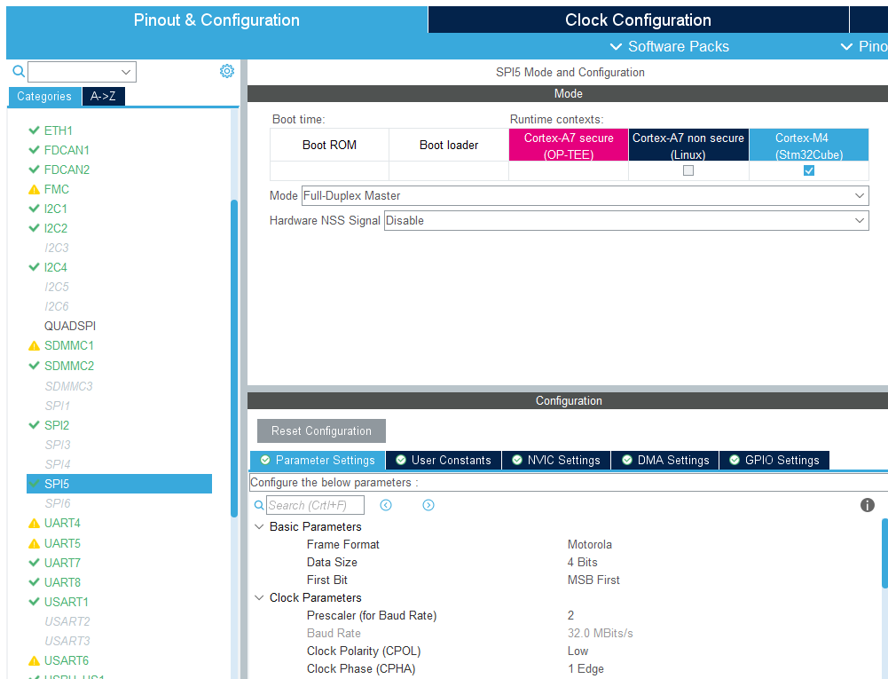

# 珠海万力达BRK-3910-IED调试记录20201024

#### 1、系统上电后无法启动，PA13指示灯无任何输出。

        经过检查发现系统复位输出一直为低电平，测量复位按钮S1的sys_rst_in信号，一直输出为低，怀疑按钮封装做错了。拆掉复位按钮S1，系统可以正常启动了。
#### 2、系统启动后接显示屏，触摸屏操作异常。

        需要更换tslib1.4版本触摸库。
#### 3、串口对应关系：

        一共8路串口输出，对应关系如下：
        ttySTM0: uart4
        ttySTM1: usart1
        ttySTM2: usart2
        ttySTM3: usart3
        ttySTM4: uart5
        ttySTM5: usart6
        ttySTM6: uart7
        ttySTM7: uart8

#### 4、tim3_ch3作为液晶屏背光亮度调节

        可以采用我编写的pwmtest程序测试背光亮度：
        ./pwmtest 通道号 周期（ns）占空比1~99（%）
        参数说明：通道号表示timer的第几路硬件通道，例如如果硬件为tim4_ch3，则通道号为ch3-1=2.通道号范围0~3.
        周期需要写入纳秒值
        占空比范围从1~99，写入10时背光灭，写入99背光最亮。
        举例：./pwmtest 2 333333 50
        表示对tim4_ch3通道设置PWM输出，输出周期333微妙，也就是3KHz频率，50%占空比。

#### 5、I2C对应关系：

        硬件I2C4作为和核心板电源管理通讯的接口，Linux下设备为：/dev/i2c-1
        硬件I2C1外接PCF8563T RTC时钟和MB85RC64TA铁电存储器，划分给M4访问，Linux下被屏蔽。
        硬件I2C2外接2路光模块，用于通讯检测光强，Linux下设备为：/dev/i2c-0。该路I2C总线内核没有设计驱动代码，用户需要自己在用户控件开发检测光强的驱动程序。

## BRK-3910 V2.01版本调试：

### 1、显示背光调试（直接在内核DTB中配置）

 可以直接在内核DTB中配置背光，先配置好pwm，然后配置背光，本设计中PB9管脚时TIMER4的第4路通道，因此配置背光时需要设置索引3：

        backlight: backlight {
		status = "okay";
		compatible = "pwm-backlight";
		pwms = <&pwm0 3 333333 0>;		//PWM背光频率3KHz	，同时第二项PWM通道索引号必须设置为3，第三项为周期，第四项为输出极性。
		brightness-levels = <
			0   1   2   3   4   5   6   7
			8   9  10  11  12  13  14  15
			16  17  18  19  20  21  22  23
			24  25  26  27  28  29  30  31
			32  33  34  35  36  37  38  39
			40  41  42  43  44  45  46  47
			48  49  50  51  52  53  54  55
			56  57  58  59  60  61  62  63
			64  65  66  67  68  69  70  71
			72  73  74  75  76  77  78  79
			80  81  82  83  84  85  86  87
			88  89  90  91  92  93  94  95
			96  97  98  99 100 101 102 103
			104 105 106 107 108 109 110 111
			112 113 114 115 116 117 118 119
			120 121 122 123 124 125 126 127
			128 129 130 131 132 133 134 135
			136 137 138 139 140 141 142 143
			144 145 146 147 148 149 150 151
			152 153 154 155 156 157 158 159
			160 161 162 163 164 165 166 167
			168 169 170 171 172 173 174 175
			176 177 178 179 180 181 182 183
			184 185 186 187 188 189 190 191
			192 193 194 195 196 197 198 199
			200 201 202 203 204 205 206 207
			208 209 210 211 212 213 214 215
			216 217 218 219 220 221 222 223
			224 225 226 227 228 229 230 231
			232 233 234 235 236 237 238 239
			240 241 242 243 244 245 246 247
			248 249 250 251 252 253 254 255>;

		default-brightness-level = <255>;        //默认255表示最大值，实际为高电平
	};

应用层操作，设置背光亮度：

        echo 255 > /sys/class/backlight/backlight/brightness //设置最大亮度
        echo 1 > /sys/class/backlight/backlight/brightness //设置最小亮度，屏幕变黑

#### 2、串口对应关系：

V2.01版本一共有5路串口输出，对应关系如下：

        ttySTM0: uart4
        ttySTM1: usart2
        ttySTM2: usart3
        ttySTM3: usart6
        ttySTM4: uart8
### 3、M4端配置说明：
#### 3.1 ADC配置

        1. ADC的CONVST脚采用GPIO：PA11，需要设置为TIM1_CH4，并采用PWM模式来启动CONVST，软件上设计为20%占空比，40KHz采样率（即1个周波采样800点）。
        2. ADC的RESET脚采用GPIO：PE15，需要设置为GPIO输出脚，在启动AD7616采样之前，需要将该脚设置为高电平。
        3. ADC的BUSY脚采用GPIO：PH3，需要设置为中断输入脚，下降沿有效。
        4. ADC采用串行模式与CPU的SPI5通讯，硬件设置模式，一次采样6个通道数据。M4的软件设计中采用DMA模式传输数据，传输宽度为8位，BURST突发模式传输。该模式需要在CubeMX软件中配置为：
                1）Clock Configration选项卡：To SPI4,5处需要选择时钟源为HSI（CPU内部时钟，64MHz）
                2）Pinout & Configration选项卡：Connectivity下，SPI5设置为：
            

                                
        注意：当采用SPI DMA方式读取AD7616的数据时，SPI的NSS片选脚需要一直设置为低电平（上图中将Hardware NSS Signal设置为Disable），
        并且SPI时钟一定要设置为MODE1或者MODE3模式。
        这样DMA方式下，SPI的SCLK将会一次性的发送：
        要读取的通道数n x 8 x 2个时钟直接给到AD7616（要按照字节模式传输DMA）。并且DMA方式读到内存中的数据，需要将高低字节做一下交换才能获取到正确的数据。
        由于硬件上AD7616的模拟输入范围被设置为：+-2.5V，因此读取到的16进制数转换为实时值的公式为：
        实时值 = 读取16进制数 / 32768 x 5 (5为量程：+2.5V - (-2.5v) = 5)
3.2 

### 4、SPI Flash配置：

 在内核的DTB中配置为：
        
        &qspi {
                	pinctrl-names = "default", "sleep";
                	pinctrl-0 = <&qspi_clk_pins_a_mx &qspi_bk1_pins_a_mx>;
                	pinctrl-1 = <&qspi_clk_sleep_pins_a_mx &qspi_bk1_sleep_pins_a_mx>;
                	// reg = <0x58003000 0x1000>, <0x70000000 0x4000000>;
                	reg = <0x58003000 0x1000>, <0x70000000 0x800000>;	//HC-800用的SPI_NOR：MX25L6433F容量为8MB
                	#address-cells = <1>;
                	#size-cells = <0>;
                	status = "okay";

                	flash0: mx25l6405d@0 {
                		compatible = "jedec,spi-nor";
                		reg = <0>;
                		spi-rx-bus-width = <4>;
                		spi-max-frequency = <108000000>;
                		#address-cells = <1>;
                		#size-cells = <1>;
                	};

                	// flash1: mx66l51235l@1 {
                	// 	compatible = "jedec,spi-nor";
                	// 	reg = <1>;
                	// 	spi-rx-bus-width = <4>;
                	// 	spi-max-frequency = <108000000>;
                	// 	#address-cells = <1>;
                	// 	#size-cells = <1>;
                	// };
        };
        
系统启动后如果内核驱动成功，则可以通过：

        cat /proc/mtd
显示其信息。然后可以通过mount命令挂载使用：

        mount -t jffs2 /dev/mtdblock1 /usr/local/spiflash
