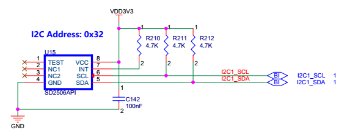
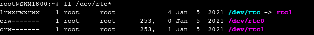

# 珠海科众SWM1800调试记录
### 1、显示背光调试（采用PWM方式设置）：
硬件设计上采用PA3——即TIMER2的第4路PWM输出，内核DTB里需要配置PWM：

        &timers2 {
                	//status = "disabled";
                	status = "okay";
                	/* spare dmas for other usage (un-delete to enable pwm capture) */
                	/delete-property/dmas;
                	/delete-property/dma-names;
                	pwm0: pwm {
                		pinctrl-0 = <&pwm2_pins_a>;
                		pinctrl-1 = <&pwm2_sleep_pins_a>;
                		pinctrl-names = "default", "sleep";
                		status = "okay";
                	};
                	timer@1 {
                		status = "okay";
                	};
        };

SWM1800的背光控制采用CPU的PA3管脚，硬件上作为TIM2_CH4，DTB里将其配置为PWM输出，可以使用pwm_test程序来输出不同占空比的背光：
        
        ./pwm_test 3 333333 50        //表示设置CH4，333333ns，频率就是3KHz，50表示50%占空比
如果需要调亮，最大可以调节为：

        ./pwm_test 3 333333 90
如果需要调暗，最小可以调节为：

        ./pwm_test 3 333333 10

为了使其在一开机上电时生效，需要将设置写入到/etc/rcS.d/S05init.sh中：
        
        #!/bin/sh
        
        #set backlight
        /usr/bin/pwmtest 3 333333 90
### 2、显示背光调试（直接在内核DTB中配置）

 可以直接在内核DTB中配置背光，先配置好pwm，然后配置背光，本设计中PA3管脚时TIMER2的第4路通道，因此配置背光时需要设置索引3：

        backlight: backlight {
		status = "okay";
		compatible = "pwm-backlight";
		pwms = <&pwm0 3 333333 0>;		//PWM背光频率3KHz	，同时第二项PWM通道索引号必须设置为3，第三项为周期，第四项为输出极性。
		brightness-levels = <
			0   1   2   3   4   5   6   7
			8   9  10  11  12  13  14  15
			16  17  18  19  20  21  22  23
			24  25  26  27  28  29  30  31
			32  33  34  35  36  37  38  39
			40  41  42  43  44  45  46  47
			48  49  50  51  52  53  54  55
			56  57  58  59  60  61  62  63
			64  65  66  67  68  69  70  71
			72  73  74  75  76  77  78  79
			80  81  82  83  84  85  86  87
			88  89  90  91  92  93  94  95
			96  97  98  99 100 101 102 103
			104 105 106 107 108 109 110 111
			112 113 114 115 116 117 118 119
			120 121 122 123 124 125 126 127
			128 129 130 131 132 133 134 135
			136 137 138 139 140 141 142 143
			144 145 146 147 148 149 150 151
			152 153 154 155 156 157 158 159
			160 161 162 163 164 165 166 167
			168 169 170 171 172 173 174 175
			176 177 178 179 180 181 182 183
			184 185 186 187 188 189 190 191
			192 193 194 195 196 197 198 199
			200 201 202 203 204 205 206 207
			208 209 210 211 212 213 214 215
			216 217 218 219 220 221 222 223
			224 225 226 227 228 229 230 231
			232 233 234 235 236 237 238 239
			240 241 242 243 244 245 246 247
			248 249 250 251 252 253 254 255>;

		default-brightness-level = <255>;        //默认255表示最大值，实际为高电平
	};

应用层操作，设置背光亮度：

        echo 255 > /sys/class/backlight/backlight/brightness //设置最大亮度
        echo 1 > /sys/class/backlight/backlight/brightness //设置最小亮度，屏幕变黑

在测试中发现还有一种方法可以设置PWM输出，在DTB中将PWM输出设置为leds模式，也可以起到调节背光的作用，具体配置如下：

        pwmleds {
		compatible = "pwm-leds";
		status = "okay";
		example {
			label = "stm32-pwm-leds-example";
			/* Use pwm1 channel 0 (e.g. TIM1_CH1) */
			/* period in nanoseconds (500000), normal polarity (0) */
			pwms = <&pwm0 3 333333 0>;
			max-brightness = <100>;
			linux,default-trigger = "backlight";
		};
	};

这种模式下，将led的trigger设置为“backlight”，就可以输出PWM波形了。
应用层操作，设置背光亮度：

        echo 100 > /sys/class/leds/stm32-pwm-leds-example/brightness //设置最大亮度，高电平
        echo 1 > /sys/class/leds/stm32-pwm-leds-example/brightness //设置最小亮度，屏幕变黑

### 3、串口序号对应关系：

        serial1 = &usart3;
	serial2 = &uart7;
	serial3 = &uart5;
	serial4 = &usart6;		 				
	serial5 = &usart1;
	serial6 = &uart8;

### 4、RTC：SD2506调试

SWM1800板子上外接了1路RTC：SD2506API，该RTC内置了可以充电的电池，因此外部不需要外接锂电池。其硬件连接原理图如下：

官网上没有SD2506的Linux内核驱动，因此我在内核代码/drviers/rtc/rtc-pcf8563.c的基础上，修改了一个驱动出来：rtc-sd25xx.c，其代码如下：

        /*
         * An I2C driver for the SD2506AP RTC
         * Copyright 2005-06 Tower Technologies
         *
         * Author: Jason.Wang <wanglei@sanway.com>
         * based on the other drivers in this same directory.
         *
         * This program is free software; you can redistribute it and/or modify
         * it under the terms of the GNU General Public License version 2 as
         * published by the Free Software Foundation.
         */

        #include <linux/clk-provider.h>
        #include <linux/i2c.h>
        #include <linux/bcd.h>
        #include <linux/rtc.h>
        #include <linux/slab.h>
        #include <linux/module.h>
        #include <linux/of.h>
        #include <linux/err.h>

        //SD-25xx Basic Time and Calendar Register definitions
        #define SD25xx_SEC		0x00
        #define SD25xx_MIN		0x01
        #define SD25xx_HOUR		0x02
        #define SD25xx_WEEK		0x03
        #define SD25xx_DAY		0x04
        #define SD25xx_MONTH		0x05
        #define SD25xx_YEAR		0x06
        #define SD25xx_ALARM_SEC	0x07
        #define SD25xx_ALARM_MIN	0x08
        #define SD25xx_ALARM_HOUR	0x09
        #define SD25xx_ALARM_WEEK	0x0A
        #define SD25xx_ALARM_DAY	0x0B
        #define SD25xx_ALARM_MONTH	0x0C
        #define SD25xx_ALARM_YEAR	0x0D

        #define SD25xx_ALARM_EN		0x0E
        #define SD25XX_ALARM_EAY	(1 << 6)
        #define SD25xx_ALARM_EAMO	(1 << 5)
        #define SD25xx_ALARM_EAD	(1 << 4)
        #define SD25xx_ALARM_EAW	(1 << 3)
        #define SD25xx_ALARM_EAH	(1 << 2)
        #define SD25xx_ALARM_EAMN	(1 << 1)
        #define SD25xx_ALARM_EAS	(1 << 0)

        #define SD25xx_CTR1		0x0F	/* Control register 1 */
        #define SD25xx_CTR1_WRTC3	(1 << 7)
        #define SD25xx_CTR1_INTAF	(1 << 5)
        #define SD25xx_CTR1_INTDF	(1 << 4)
        #define SD25xx_CTR1_WRTC2	(1 << 2)
        #define SD25xx_CTR1_RTCF	(1 << 0)

        #define SD25xx_CTR2		0x10
        #define SD25xx_CTR2_WRTC1	(1 << 7)
        #define SD25xx_CTR2_IM		(1 << 6)
        #define SD25xx_CTR2_INTS1	(1 << 5)
        #define SD25xx_CTR2_INTS0	(1 << 4)
        #define SD25xx_CTR2_FOBAT	(1 << 3)
        #define SD25xx_CTR2_INTDE	(1 << 2)
        #define SD25xx_CTR2_INTAE	(1 << 1)
        #define SD25xx_CTR2_INTFE	(1 << 0)

        #define SD25xx_CTR3		0x11
        #define SD25xx_CTR3_ARST	(1 << 7)
        #define SD25xx_CTR3_TDS1	(1 << 5)
        #define SD25xx_CTR3_TDS0	(1 << 4)
        #define SD25xx_CTR3_FS3		(1 << 3)
        #define SD25xx_CTR3_FS2		(1 << 2)
        #define SD25xx_CTR3_FS1		(1 << 1)
        #define SD25xx_CTR3_FS0		(1 << 0)

        #define SD25XX_CHARGE		0x18	//添加0x18寄存器用于访问充电模式，厂家建议每次上电时该寄存器配置为0x82
        #define SD25XX_CHARGE_ENCH	(1 << 7)
        #define SD25XX_CHARGE_CHARGE1	(1 << 1)
        #define SD25XX_CHARGE_CHARGE0	(1 << 0)

        #define SD25xx_CTR5		0x1A
        #define SD25xx_CTR5_BAT8_VAL	(1 << 7)
        #define SD25XX_CTR5_BHF		(1 << 1)
        #define SD25XX_CTR5_BLF		(1 << 0)

        #define SD25xx_BAT_VAL		0x1B
        #define SD25xx_CTR5_BAT7_VAL	(1 << 7)
        #define SD25xx_CTR5_BAT6_VAL	(1 << 6)
        #define SD25xx_CTR5_BAT5_VAL	(1 << 5)
        #define SD25xx_CTR5_BAT4_VAL	(1 << 4)
        #define SD25xx_CTR5_BAT3_VAL	(1 << 3)
        #define SD25xx_CTR5_BAT2_VAL	(1 << 2)
        #define SD25xx_CTR5_BAT1_VAL	(1 << 1)
        #define SD25xx_CTR5_BAT0_VAL	(1 << 0)

        #define	SD25xx_ID_1st		0x72
        #define SD25xx_I2C_ADDR		0x32

        static struct i2c_driver sd25xx_driver;

        struct sd25xx {
        	struct rtc_device *rtc;
        	int voltage_low; /* incicates if a low_voltage was detected */
        	int voltage_high;	/*电池电量过压*/
        	struct i2c_client *client;
        };

        static int sd25xx_read_block_data(struct i2c_client *client, unsigned char reg,
        				   unsigned char length, unsigned char *buf)
        {
        	struct i2c_msg msgs[] = {
        		{/* setup read ptr */
        			.addr = client->addr,
        			.len = 1,
        			.buf = &reg,
        		},
        		{
        			.addr = client->addr,
        			.flags = I2C_M_RD,
        			.len = length,
        			.buf = buf
        		},
        	};

        	if ((i2c_transfer(client->adapter, msgs, 2)) != 2) {
        		dev_err(&client->dev, "%s: read error\n", __func__);
        		return -EIO;
        	}

        	return 0;
        }

        static int sd25xx_write_block_data(struct i2c_client *client,
        				   unsigned char reg, unsigned char length,
        				   unsigned char *buf)
        {
        	int i, err;

        	for (i = 0; i < length; i++) {
        		unsigned char data[2] = { reg + i, buf[i] };

        		err = i2c_master_send(client, data, sizeof(data));
        		if (err != sizeof(data)) {
        			dev_err(&client->dev,
        				"%s: err=%d addr=%02x, data=%02x\n",
        				__func__, err, data[0], data[1]);
        			return -EIO;
        		}
        	}

        	return 0;
        }

        /*
         * In the routines that deal directly with the SD25xx hardware, we use
         * rtc_time -- month 0-11, hour 0-23, yr = calendar year-epoch.
         */
        static int sd25xx_get_datetime(struct i2c_client *client, struct rtc_time *tm)
        {
        	struct sd25xx *sd25xx_rtc = i2c_get_clientdata(client);
        	unsigned char buf[32];
        	int err;

        	err = sd25xx_read_block_data(client, SD25xx_SEC, 32, buf);
        	if (err)
        		return err;

        	//如果电池电量低，则提示错误
        	if (buf[SD25xx_CTR5] & SD25XX_CTR5_BLF) {
        		sd25xx_rtc->voltage_low = 1;
        		dev_err(&client->dev,
        			"Battery low voltage detected, date/time is not reliable.\n");
        		return -EINVAL;
        	}

        	//如果电池电量过高，提示错误
        	if (buf[SD25xx_CTR5] & SD25XX_CTR5_BHF) {
        		sd25xx_rtc->voltage_high = 1;
        		dev_err(&client->dev,
        			"Battery high voltage detected, date/time is not reliable.\n");
        		return -EINVAL;
        	}

        	dev_dbg(&client->dev, "%s: read 0x%02x 0x%02x "
        		"0x%02x 0x%02x 0x%02x 0x%02x 0x%02x\n", __func__,
        		buf[0], buf[1], buf[2], buf[3], buf[4], buf[5], buf[6]);

        	tm->tm_sec  = bcd2bin(buf[SD25xx_SEC] & 0x7F);
        	tm->tm_min  = bcd2bin(buf[SD25xx_MIN] & 0x7F);
        	tm->tm_hour = bcd2bin(buf[SD25xx_HOUR] & 0x3F); /* rtc hr 0-23 */	
        	tm->tm_wday = bcd2bin(buf[SD25xx_WEEK] & 0x7F);
        	tm->tm_mday = bcd2bin(buf[SD25xx_DAY] & 0x3F);
        	tm->tm_mon  = bcd2bin(buf[SD25xx_MONTH] & 0x1F); /* rtc mn 1-12 */
        	tm->tm_year = bcd2bin(buf[SD25xx_YEAR]);

        	if (tm->tm_year < 70)
        		tm->tm_year += 100;	/* assume we are in 1970...2069 */

        	dev_dbg(&client->dev, "%s: tm is secs=%d, mins=%d, hours=%d, "
        		"mday=%d, mon=%d, year=%d, wday=%d\n",
        		__func__,
        		tm->tm_sec, tm->tm_min, tm->tm_hour,
        		tm->tm_mday, tm->tm_mon, tm->tm_year, tm->tm_wday);

        	return 0;
        }

        //----------------------------------------------------------------------
        // SD25xx_write_enable()
        // sets SD25xx write enable
        //----------------------------------------------------------------------
        static void sd25xx_write_enable(struct i2c_client *client)				
        {
        	unsigned char ret;
        	sd25xx_read_block_data(client, SD25xx_CTR2, 1, &ret);
        	ret = ret | SD25xx_CTR2_WRTC1;
        	sd25xx_write_block_data(client, SD25xx_CTR2, 1, &ret);

        	sd25xx_read_block_data(client, SD25xx_CTR1, 1, &ret);
        	ret = ret | SD25xx_CTR1_WRTC3 | SD25xx_CTR1_WRTC2;
        	sd25xx_write_block_data(client, SD25xx_CTR1, 1, &ret);
        }

        //----------------------------------------------------------------------
        // SD25xx_write_disable()
        // sets SD25xx write disable
        //----------------------------------------------------------------------
        static void sd25xx_write_disable(struct i2c_client *client)
        {
        	unsigned char ret;

        	sd25xx_read_block_data(client, SD25xx_CTR1, 1, &ret);
        	ret = ret & (~SD25xx_CTR1_WRTC3) & (~SD25xx_CTR1_WRTC2);
        	sd25xx_write_block_data(client, SD25xx_CTR1, 1, &ret);

        	sd25xx_read_block_data(client, SD25xx_CTR2, 1, &ret);
        	ret = ret & (~SD25xx_CTR2_WRTC1);
        	sd25xx_write_block_data(client, SD25xx_CTR2, 1, &ret);
        }

        static int sd25xx_set_datetime(struct i2c_client *client, struct rtc_time *tm)
        {
        	struct sd25xx *sd25xx_rtc = i2c_get_clientdata(client);
        	unsigned char buf[7];
        	int ret = -1;

        	dev_dbg(&client->dev, "%s: secs=%d, mins=%d, hours=%d, "
        		"mday=%d, mon=%d, year=%d, wday=%d\n",
        		__func__,
        		tm->tm_sec, tm->tm_min, tm->tm_hour,
        		tm->tm_mday, tm->tm_mon, tm->tm_year, tm->tm_wday);

        	/* hours, minutes and seconds */
        	buf[SD25xx_SEC] = bin2bcd(tm->tm_sec);
        	buf[SD25xx_MIN] = bin2bcd(tm->tm_min);
        	buf[SD25xx_HOUR] = bin2bcd(tm->tm_hour) | 0x80;
        	buf[SD25xx_WEEK] = bin2bcd(tm->tm_wday);
        	buf[SD25xx_DAY] = bin2bcd(tm->tm_mday);
        	buf[SD25xx_MONTH] = bin2bcd(tm->tm_mon);

        	/* year and century */
        	buf[SD25xx_YEAR] = bin2bcd(tm->tm_year % 100);

        	dev_dbg(&client->dev, "%s: write 0x%02x 0x%02x 0x%02x 0x%02x 0x%02x 0x%02x 0x%02x\n",
        		__func__, buf[0], buf[1], buf[2], buf[3], buf[4], buf[5], buf[6]);
        	
        	sd25xx_write_enable(client);
        	ret = sd25xx_write_block_data(client, SD25xx_SEC, 7, buf);
        	if (ret)
        		dev_err(&client->dev, "Unable to write registers #%d..#%d\n", SD25xx_SEC, SD25xx_SEC + 7 - 1);
        	sd25xx_write_disable(client);

        	return ret;
        }

        #ifdef CONFIG_RTC_INTF_DEV
        static int sd25xx_rtc_ioctl(struct device *dev, unsigned int cmd, unsigned long arg)
        {
        	struct sd25xx *sd25xx_rtc = i2c_get_clientdata(to_i2c_client(dev));
        	struct rtc_time tm;

        	switch (cmd) {
        	case RTC_VL_READ:
        		if (sd25xx_rtc->voltage_low)
        			dev_info(dev, "low voltage detected, date/time is not reliable.\n");

        		if (copy_to_user((void __user *)arg, &sd25xx_rtc->voltage_low,
        					sizeof(int)))
        			return -EFAULT;
        		return 0;
        	case RTC_VL_CLR:
        		/*
        		 * Clear the VL bit in the seconds register in case
        		 * the time has not been set already (which would
        		 * have cleared it). This does not really matter
        		 * because of the cached voltage_low value but do it
        		 * anyway for consistency.
        		 */
        		if (sd25xx_get_datetime(to_i2c_client(dev), &tm))
        			sd25xx_set_datetime(to_i2c_client(dev), &tm);

        		/* Clear the cached value. */
        		sd25xx_rtc->voltage_low = 0;

        		return 0;
        	default:
        		return -ENOIOCTLCMD;
        	}
        }
        #else
        #define sd25xx_rtc_ioctl NULL
        #endif

        static int sd25xx_rtc_read_time(struct device *dev, struct rtc_time *tm)
        {
        	return sd25xx_get_datetime(to_i2c_client(dev), tm);
        }

        static int sd25xx_rtc_set_time(struct device *dev, struct rtc_time *tm)
        {
        	return sd25xx_set_datetime(to_i2c_client(dev), tm);
        }

        //static int pcf8563_rtc_read_alarm(struct device *dev, struct rtc_wkalrm *tm)
        //{
        //	struct i2c_client *client = to_i2c_client(dev);
        //	unsigned char buf[4];
        //	int err;
        //
        //	err = pcf8563_read_block_data(client, PCF8563_REG_AMN, 4, buf);
        //	if (err)
        //		return err;
        //
        //	dev_dbg(&client->dev,
        //		"%s: raw data is min=%02x, hr=%02x, mday=%02x, wday=%02x\n",
        //		__func__, buf[0], buf[1], buf[2], buf[3]);
        //
        //	tm->time.tm_sec = 0;
        //	tm->time.tm_min = bcd2bin(buf[0] & 0x7F);
        //	tm->time.tm_hour = bcd2bin(buf[1] & 0x3F);
        //	tm->time.tm_mday = bcd2bin(buf[2] & 0x3F);
        //	tm->time.tm_wday = bcd2bin(buf[3] & 0x7);
        //
        //	err = pcf8563_get_alarm_mode(client, &tm->enabled, &tm->pending);
        //	if (err < 0)
        //		return err;
        //
        //	dev_dbg(&client->dev, "%s: tm is mins=%d, hours=%d, mday=%d, wday=%d,"
        //		" enabled=%d, pending=%d\n", __func__, tm->time.tm_min,
        //		tm->time.tm_hour, tm->time.tm_mday, tm->time.tm_wday,
        //		tm->enabled, tm->pending);
        //
        //	return 0;
        //}

        static int sd25xx_rtc_set_alarm(struct device *dev, struct rtc_wkalrm *tm)
        {
        	struct i2c_client *client = to_i2c_client(dev);
        	unsigned char buf[7];
        	int err;

        	buf[0] = bin2bcd(tm->time.tm_sec);
        	buf[1] = bin2bcd(tm->time.tm_min);
        	buf[2] = bin2bcd(tm->time.tm_hour);
        	buf[3] = bin2bcd(tm->time.tm_wday);
        	buf[4] = bin2bcd(tm->time.tm_mday);		
        	buf[5] = bin2bcd(tm->time.tm_mon);
        	buf[6] = bin2bcd(tm->time.tm_year % 100);

        	sd25xx_write_enable(client);
        	err = sd25xx_write_block_data(client, SD25xx_ALARM_SEC, 7, buf);
        	sd25xx_write_disable(client);
        	return err;	
        }

        static const struct rtc_class_ops sd25xx_rtc_ops = {
        	.ioctl		= sd25xx_rtc_ioctl,
        	.read_time	= sd25xx_rtc_read_time,
        	.set_time	= sd25xx_rtc_set_time,
        //	.read_alarm	= pcf8563_rtc_read_alarm,
        	.set_alarm	= sd25xx_rtc_set_alarm,
        //	.alarm_irq_enable = pcf8563_irq_enable,
        };

        static int sd25xx_probe(struct i2c_client *client,
        				const struct i2c_device_id *id)
        {
        	struct sd25xx *sd25xx_rtc;
        	int err;
        	unsigned char buf;

        	dev_dbg(&client->dev, "%s\n", __func__);

        	if (!i2c_check_functionality(client->adapter, I2C_FUNC_I2C))
        		return -ENODEV;

        	sd25xx_rtc = devm_kzalloc(&client->dev, sizeof(struct sd25xx),
        				GFP_KERNEL);
        	if (!sd25xx_rtc)
        		return -ENOMEM;

        	i2c_set_clientdata(client, sd25xx_rtc);
        	sd25xx_rtc->client = client;
        	device_set_wakeup_capable(&client->dev, 1);

        	/* 每次上电时需要对CHARGE寄存器0x18写入0x82) */
        	buf = 0x82;
        	sd25xx_write_enable(client);
        	err = sd25xx_write_block_data(client, SD25XX_CHARGE, 1, &buf);
        	sd25xx_write_disable(client);

        	if (err < 0) {
        		dev_err(&client->dev, "%s: write error\n", __func__);
        		return err;
        	}

        	sd25xx_rtc->rtc = devm_rtc_device_register(&client->dev,
        				sd25xx_driver.driver.name,
        				&sd25xx_rtc_ops, THIS_MODULE);

        	if (IS_ERR(sd25xx_rtc->rtc))
        		return PTR_ERR(sd25xx_rtc->rtc);

        	return 0;
        }

        static const struct i2c_device_id sd25xx_id[] = {
        	{ "sd25xx", 0 },	
        	{ }
        };
        MODULE_DEVICE_TABLE(i2c, sd25xx_id);

        #ifdef CONFIG_OF
        static const struct of_device_id sd25xx_of_match[] = {
        	{ .compatible = "wave,sd25xx" },
        	{}
        };
        MODULE_DEVICE_TABLE(of, sd25xx_of_match);
        #endif

        static struct i2c_driver sd25xx_driver = {
        	.driver		= {
        		.name	= "rtc-sd25xx",
        		.of_match_table = of_match_ptr(sd25xx_of_match),
        	},
        	.probe		= sd25xx_probe,
        	.id_table	= sd25xx_id,
        };

        module_i2c_driver(sd25xx_driver);

        MODULE_AUTHOR("Jason Wang <wanglei@szsanway.com>");
        MODULE_DESCRIPTION("WAVE SD25XX RTC driver");
        MODULE_LICENSE("GPL");

使用时，需要在DTB中配置（硬件设计上接在I2C1上，SD2506API的Linux I2C地址为：0x32）：

        &i2c1 {
                	pinctrl-names = "default", "sleep";
                	pinctrl-0 = <&i2c1_pins_a>;
                	pinctrl-1 = <&i2c1_pins_sleep_a>;
                	i2c-scl-rising-time-ns = <100>;
                	i2c-scl-falling-time-ns = <7>;
                	status = "okay";
                	/delete-property/dmas;
                	/delete-property/dma-names;

                	sd25xx: rtc@32 {
                		compatible = "wave,sd25xx";
                		reg = <0x32>;
                	};
        }；
因为STM32MP153D CPU中已经带了1路RTC，因此内核启动后会将SD2506API这1路识别为rtc1，默认内核采用rtc0来校时，为了能够让内核使用rtc1进行校时，需要配置内核：

Device Drivers -> Real Time Clock

(如下图所示）：

即将括号内的rtc0改为rtc1，然后重新编译内核，再烧入板子加载，就可以了。此时用：

        ll /dev/rtc*
        
可以看到默认rtc已经链接到了rtc1：

### 5、修改系统启动logo，添加用户自定义logo

1、按照3.2内核修改内核代码：/drivers/video/logo/logo.c，具体代码如下：

        /*
         *  Linux logo to be displayed on boot
         *
         *  Copyright (C) 1996 Larry Ewing (lewing@isc.tamu.edu)
         *  Copyright (C) 1996,1998 Jakub Jelinek (jj@sunsite.mff.cuni.cz)
         *  Copyright (C) 2001 Greg Banks <gnb@alphalink.com.au>
         *  Copyright (C) 2001 Jan-Benedict Glaw <jbglaw@lug-owl.de>
         *  Copyright (C) 2003 Geert Uytterhoeven <geert@linux-m68k.org>
         */

        #include <linux/linux_logo.h>
        #include <linux/stddef.h>
        #include <linux/module.h>

        #ifdef CONFIG_M68K
        #include <asm/setup.h>
        #endif

        #include <asm/io.h>
        #include <linux/gfp.h>
        #include <linux/slab.h>

        static bool nologo;
        module_param(nologo, bool, 0);
        MODULE_PARM_DESC(nologo, "Disables startup logo");

        /*
         * Logos are located in the initdata, and will be freed in kernel_init.
         * Use late_init to mark the logos as freed to prevent any further use.
         */

        static bool logos_freed;

        static int __init fb_logo_late_init(void)
        {
        	logos_freed = true;
        	return 0;
        }

        late_initcall_sync(fb_logo_late_init);

        /* logo's are marked __initdata. Use __ref to tell
         * modpost that it is intended that this function uses data
         * marked __initdata.
         */
        const struct linux_logo * __ref fb_find_logo(int depth)
        {
        	//const struct linux_logo *logo = NULL;
        	struct linux_logo *logo = NULL;
        	int i = 0, k = 0;
        	//struct linux_logo *logo_buf = NULL;
        	unsigned char *clut = NULL, *data = NULL;
        	volatile void *mapped_area = NULL;
        	unsigned int height = 0, width = 0, pixsize = 0;

        	if (nologo || logos_freed)
        		return NULL;

        //	if (depth >= 1) {
        //#ifdef CONFIG_LOGO_LINUX_MONO
        //		/* Generic Linux logo */
        //		logo = &logo_linux_mono;
        //#endif
        //#ifdef CONFIG_LOGO_SUPERH_MONO
        //		/* SuperH Linux logo */
        //		logo = &logo_superh_mono;
        //#endif
        //	}
        //
        //	if (depth >= 4) {
        //#ifdef CONFIG_LOGO_LINUX_VGA16
        //		/* Generic Linux logo */
        //		logo = &logo_linux_vga16;
        //#endif
        //#ifdef CONFIG_LOGO_SUPERH_VGA16
        //		/* SuperH Linux logo */
        //		logo = &logo_superh_vga16;
        //#endif
        //	}
        //
        //	if (depth >= 8) {
        //#ifdef CONFIG_LOGO_LINUX_CLUT224
        //		/* Generic Linux logo */
        //		logo = &logo_linux_clut224;
        //#endif
        //#ifdef CONFIG_LOGO_DEC_CLUT224
        //		/* DEC Linux logo on MIPS/MIPS64 or ALPHA */
        //		logo = &logo_dec_clut224;
        //#endif
        //#ifdef CONFIG_LOGO_MAC_CLUT224
        //		/* Macintosh Linux logo on m68k */
        //		if (MACH_IS_MAC)
        //			logo = &logo_mac_clut224;
        //#endif
        //#ifdef CONFIG_LOGO_PARISC_CLUT224
        //		/* PA-RISC Linux logo */
        //		logo = &logo_parisc_clut224;
        //#endif
        //#ifdef CONFIG_LOGO_SGI_CLUT224
        //		/* SGI Linux logo on MIPS/MIPS64 */
        //		logo = &logo_sgi_clut224;
        //#endif
        //#ifdef CONFIG_LOGO_SUN_CLUT224
        //		/* Sun Linux logo */
        //		logo = &logo_sun_clut224;
        //#endif
        //#ifdef CONFIG_LOGO_SUPERH_CLUT224
        //		/* SuperH Linux logo */
        //		logo = &logo_superh_clut224;
        //#endif
        //	}

        	mapped_area = __va(0xc4300000);

        	logo = kmalloc(sizeof(struct linux_logo), GFP_KERNEL);
        	if(!logo){
        		printk("kmalloc error!\n");
        		return NULL;
        	}

        	logo->type = 3;
        	logo->width = 800;
        	logo->height = 480;
        	logo->clutsize = 224;

        	width = (*(unsigned char*)(mapped_area)<<24) | (*(unsigned char*)(mapped_area+1)<<16) \
        			| (*(unsigned char *)(mapped_area+2)<<8) | (*(unsigned char*)(mapped_area+3));

        	height = (*(unsigned char*)(mapped_area+4)<<24) | (*(unsigned char*)(mapped_area+5)<<16) \
        			| (*(unsigned char *)(mapped_area+6)<<8) | (*(unsigned char*)(mapped_area+7));

        	logo->width = width;
        	logo->height = height;
        	pixsize = width*height;
        	printk("Logo parameter width:%d height:%d ", width, height);

        	data = kmalloc(pixsize, GFP_KERNEL);
        	if(!data){
        		printk("kmalloc data error!\n");
        		kfree(logo);
        		return NULL;
        	}

        	for(i = 0; i < pixsize; i++){
        		data[i] = *(unsigned char *)(mapped_area+8+i);
        	}

        	logo->clutsize = (*(unsigned char *)(mapped_area+8+pixsize)<<24) | (*(unsigned char *)(mapped_area+8+pixsize+1)<<16) \
        			| (*(unsigned char *)(mapped_area+8+pixsize+2)<<8) | (*(unsigned char *)(mapped_area+8+pixsize+3));
        	printk("clutsize:%d\n", logo->clutsize);

        	clut = kmalloc(logo->clutsize*3, GFP_KERNEL);
        	if(!clut){
        		printk("kmalloc clut error!\n");
        		kfree(data);
        		kfree(logo);
        		return NULL;
        	}

        	for(i = 0, k = 0; i < logo->clutsize; k+=3, i++){
        		clut[k] = *(unsigned char *)(mapped_area+8+pixsize+4+k);
        		clut[k+1] = *(unsigned char *)(mapped_area+8+pixsize+4+k+1);
        		clut[k+2] = *(unsigned char *)(mapped_area+8+pixsize+4+k+2);
        	}

        	logo->clut = clut;
        	logo->data = data;

        	return logo;
        }
        EXPORT_SYMBOL_GPL(fb_find_logo);

2、修改u-boot环境变量：

        setenv bootcmd "ext4load mmc 1:2 $splashimage logo.bin; run bootcmd_stm32mp"
        其中，$splashimage在uboot环境变量中被定义为：splashimage=0xc4300000
3、制作bin二级制格式的图片，并将其命名为logo.bin，复制到/boot目录下。

4、重启系统。