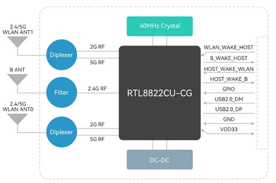
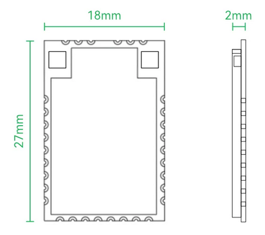
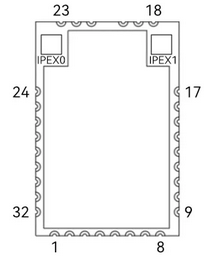

# 必联公司BL-M8822CU3-B模块资料

模块网址：[product_37_285.html](https://www.b-link.net.cn/product_37_285.html)

---

## 亮点介绍：

---

## 规格参数：

|   **项目**   |        **描述**         |
| :----------: | :--------------------: |
|   **芯片**   |      RTL8822CU-CG      |
|   **标准**   | IEEE 802.11 a/b/g/n/ac |
|   **频率**   |        2.4/5GHz        |
|   **接口**   |          USB           |
| **工作模式** |    SoftAP, Station     |
|   **尺寸**   |    27 x 18 x 2.2mm     |
|   **供电**   |      3.3V ± 0.2V       |
| **工作温度** |      -20℃ ~ +70℃      |
|   **功耗**   |        ≤ 1200mA        |
|   **功率**   |        ≤ 20dBm         |

---

## 方框图：

## 产品尺寸：

---

## 引脚定义：

---

| **序号** |  **引脚名称**   | **类型** |                                                     **引脚定义**                                                      |
| :------: | :------------: | :------: | -------------------------------------------------------------------------------------------------------------------- |
|    1     |     GPIO5      |   I/O    | 1. 通用GPIO； 2. 外部Flash data SIO1信号线                                                                         |
|    2     |     GPIO4      |   I/O    | 1. 通用GPIO； 2. 外部Flash data SIO0信号线。 3. Test mode选择输入，默认拉低为Normal mode，拉高即为Test mode。     |
|    3     |      EESK      |    I     | 外部Flash时钟输入信号                                                                                                  |
|    4     |      EECS      |   I/O    | 1. 外部Flash片选输入信号。 2. 外部32.768KHz或者RTC时钟信号。                                                         |
|    5     |      GND       |    P     | 电源地                                                                                                                |
|    6     |   USB2.0_DP    |   AI/O   | USB2.0差分传输线+                                                                                                     |
|    7     |   USN2.0_DM    |   AI/O   | USB2.0差分传输线-                                                                                                     |
|    8     |      GND       |    P     | 电源地                                                                                                                |
|    9     |     GPIO3      |   I/O    | 1. 通用GPIO； 2. WPS功能信号线，输入高有效，内部被47K电阻下拉至地。                                                   |
|    10    |      LED       |   I/O    | 1. 通用GPIO8； 2. WLAN led输出信号，低有效。                                                                        |
|    11    |      GND       |   P_RF   | RF电源地                                                                                                              |
|    12    |      B_RF      |    RF    | B_ANT的RF天线管脚。                                                                                                    |
|    13    |      GND       |   P_RF   | RF电源地                                                                                                              |
|    14    |  B_WAKE_HOST   |   I/O    | 1. 通用GPIO14； 2. 当远程唤醒功能使能时，作为输出信号以唤醒HOST。可由用户来定义极性。                                   |
|    15    |  HOST_WAKE_B   |   I/O    | 1. 通用GPIO13； 2. 在远程唤醒模式下，用于HOST唤醒B。输入信号。                                                       |
|    16    |     GPIO0      |   I/O    | 1. 通用GPIO； 2. B测试UART_RX输入信号。                                                                            |
|    17    |     GPIO1      |   I/O    | 1. 通用GPIO； 2. B测试UART_TX输出信号。                                                                            |
|    18    |      GND       |   P_RF   | RF电源地。                                                                                                            |
|    19    |   WLAN_ANT1    |    RF    | WLAN_ANT1的RF天线管脚。                                                                                                |
|    20    |      GND       |   P_RF   | RF电源地。                                                                                                            |
|    21    |      GND       |   P_RF   | RF电源地。                                                                                                            |
|    22    |   WLAN_ANT0    |    RF    | WLAN_ANT0的RF天线管脚。                                                                                                |
|    23    |      GND       |   P_RF   | RF电源地。                                                                                                            |
|    24    |      GND       |    P     | 电源地。                                                                                                              |
|    25    |      GND       |    P     | 电源地。                                                                                                              |
|    26    | WLAN_WAKE_HOST |   I/O    | 1. 通用GPIO6； 2. 输出信号。当远程唤醒功能使能时，WLAN唤醒HOST。可由用户来定义极性。 3. 外部FLash data SIO2信号线。 |
|    27    |     RESET      |    I     | 电源复位输入信号，低有效。内部被47K电阻上拉。                                                                            |
|    28    | HOST_WAKE_WLAN |   I/O    | 1. 通用GPIO7。 2. 输入信号。在远程唤醒模式下，用于HOST唤醒WLAN。 3. 外部Flash data SIO3信号线。                    |
|    29    |      GND       |    P     | 电源地。                                                                                                              |
|    30    |     VDD33      |    P     | 3.3V主电源输入。                                                                                                       |
|    31    |       NC       |    --    | NC未连接。                                                                                                            |
|    32    |      GND       |    P     | 电源地。                                                                                                              |